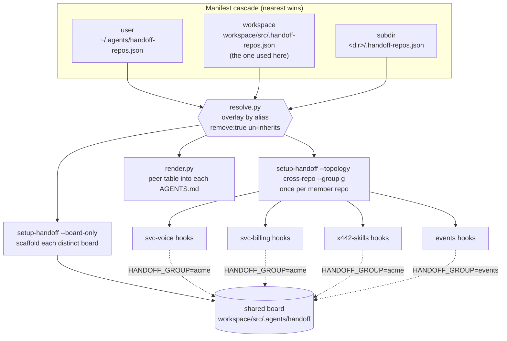
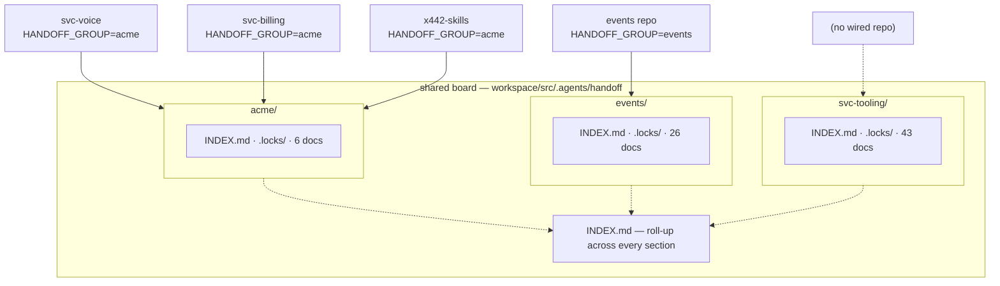

# Usage record — a shared handoff board across many repos and many groups

A record of how [`setup-handoff`](../skills/engineering/setup-handoff/SKILL.md) and
[`register-cross-repo-handoff`](../skills/engineering/register-cross-repo-handoff/SKILL.md) were
actually used to put **four repos** on **one centralized board**, split across **three independent
groups of projects** co-hosted in a single place.

Everything below is transcribed from the live install in this workspace — the manifest, the
generated hook commands, the board layout, and the verifier output are copied verbatim, not
illustrative. Where a feature is described but not exercised here (the `prefix` layout, a group
given its own separate board), it is marked as such and shown from the skill's contract.

| Fact                    | Value                                                                                              |
| ----------------------- | -------------------------------------------------------------------------------------------------- |
| Board                   | `workspace/src/.agents/handoff` — a standalone directory, owned by no member repo                  |
| Topology                | `cross-repo`                                                                                       |
| Groups hosted           | `acme`, `svc-tooling`, `events` — three sections on one board                                      |
| Layout                  | `subfolder` — each section is `<board>/<group>/`                                                   |
| Members                 | `acme`: `svc-voice`, `svc-billing`, `x442-skills` · `events`: `events` · `svc-tooling`: none wired |
| Docs per section        | `acme` 6 · `svc-tooling` 43 · `events` 26                                                          |
| Declared in             | `workspace/src/.handoff-repos.json` (workspace layer of the cascade)                               |
| Wired into this repo by | commit `e52fa5c` — `.claude/settings.json`, `.github/hooks/handoff.json`, `AGENTS.md`              |
| Health                  | `verify-cross-repo-handoff.sh` → **13 passed, 0 warnings, 0 failed**                               |

The board started as a single `acme` section holding all four repos and grew into three sections
while this document was being written — `events` was split into its own group, and `svc-tooling` was
added. That regrouping is itself recorded below (§4), because it is the operation an adopting team
will reach for first and it is a manifest edit, not a migration.

## Division of labor between the two skills

`setup-handoff` knows how to build **one** board and wire **one** repo to it. It has no opinion
about fleets. `register-cross-repo-handoff` is the fleet driver: it reads a manifest, then calls
`setup-handoff` once per board and once per member.

| Step                                      | Who does it                                       | Concretely                                                             |
| ----------------------------------------- | ------------------------------------------------- | ---------------------------------------------------------------------- |
| Scaffold a standalone board (no owner)    | `setup-handoff --board-only`                      | `handoff` CLI, `scripts/hooks.sh`, `templates/`, `config`, `README.md` |
| Wire one repo to a board section          | `setup-handoff --topology cross-repo --group <g>` | per-tool hooks + `additionalDirectories` + AGENTS.md block             |
| Resolve the fleet manifest cascade        | `register-cross-repo-handoff`                     | `scripts/manifest/resolve.py`                                          |
| Render the peer table into each AGENTS.md | `register-cross-repo-handoff`                     | `scripts/manifest/render.py`                                           |
| Record the fleet for later `--prune`      | `register-cross-repo-handoff`                     | `<scope>/.agents/cross-repo-handoff-state.json`                        |

You never run the per-repo installer by hand in a fleet. The manifest is the source of truth; the
sync is the only writer.

## 1. The manifest actually used

The cascade is `~/.agents/handoff-repos.json` → `<workspace>/.handoff-repos.json` →
`<subdir>/.handoff-repos.json`, nearest wins — the same shape as `AGENTS.md`. Only the workspace
layer exists here, at `workspace/src/.handoff-repos.json`:

```json
{
  "version": 1,
  "board": "./.agents/handoff",
  "layout": "subfolder",
  "groups": {
    "events": {
      "repos": [
        {
          "alias": "events",
          "path": "./acme-svc-event-writer",
          "audience": "acme-svc-event-writer",
          "notes": "Events — Kafka consumer writing event payloads to NAS/Blob"
        }
      ]
    },
    "acme": {
      "repos": [
        {
          "alias": "svc-voice",
          "path": "./acme-svc-voice-ingest",
          "audience": "acme-svc-voice-ingest",
          "notes": "voice usage ingest"
        },
        {
          "alias": "svc-billing",
          "path": "./acme-svc-billing-ingest",
          "audience": "acme-svc-billing-ingest",
          "notes": "billing usage ingest"
        },
        {
          "alias": "x442-skills",
          "path": "../../x442-skills",
          "audience": "x442-skills",
          "notes": "agent skills — owns the porting/migration handoffs"
        }
      ]
    },
    "svc-tooling": {
      "repos": []
    }
  }
}
```

Three details worth copying:

- **Paths resolve against the manifest that declared them**, so a committed relative path means the
  same checkout on every machine. `x442-skills` lives outside the workspace and is reached with
  `../../x442-skills` — a member does **not** have to be a sibling of the board.
- **`audience` is the acts-next routing name**, defaulting to `alias`. Here the ACME services use
  their full repo names while `x442-skills` uses its alias. That name is what another repo types in
  `handoff new … --audience <name>` to hand work over.
- **A group may declare no repos at all.** `svc-tooling` has `"repos": []` and still gets a real
  section with 43 docs in it. Nothing is wired to it, so no repo's hooks scope a session there —
  the docs are authored board-side (`handoff new --group svc-tooling …`) and routed by `audience` to
  repos that are not board members. That is the shape to use for tracking work in repos you have not
  onboarded yet, or will never onboard.

## 2. What the sync wrote

```bash
# preview — writes nothing, surfaces resolve errors (missing repo, bad path)
bash skills/engineering/register-cross-repo-handoff/scripts/sync-cross-repo-handoff.sh \
  --scope ../workspace/src --dry-run

# apply
bash skills/engineering/register-cross-repo-handoff/scripts/sync-cross-repo-handoff.sh \
  --scope ../workspace/src --tools claude,copilot --primary copilot
```

Landing in this repo as commit `e52fa5c`:

```text
 .claude/settings.json      | 34 ++++++++++------------------------
 .github/hooks/handoff.json | 25 +++++++++++++++++++++++--
 AGENTS.md                  | 35 +++++++++++++++++++++++++++++++++++
```

The generated hook command carries the entire per-repo identity as environment on the command
itself — nothing repo-specific is written into the shared board:

```text
HANDOFF_REPO=x442-skills \
HANDOFF_HDPATH=../workspace/src/.agents/handoff \
HANDOFF_GROUP=acme \
bash "$CLAUDE_PROJECT_DIR/../workspace/src/.agents/handoff/scripts/hooks.sh" \
  --kind sessionstart --tool claude
```

| Variable         | Purpose                                                                      |
| ---------------- | ---------------------------------------------------------------------------- |
| `HANDOFF_REPO`   | who I am — used for lease ownership and the acts-next default                |
| `HANDOFF_HDPATH` | relative board path, so the session-start hint prints commands you can paste |
| `HANDOFF_GROUP`  | **which section I see** — the whole basis of group isolation                 |

The board's own `config` stays repo-neutral and holds only board-global facts:

```text
TOPOLOGY=cross-repo
HANDOFF_GROUPS=acme,svc-tooling,events
HANDOFF_GROUP_LAYOUT=subfolder
```

`HANDOFF_GROUPS` is board-global and only the roll-up reads it; `HANDOFF_GROUP` on the hook command
is what any single invocation acts within. Note the name: a config key called `GROUPS` would be
unreadable, because `GROUPS` is a bash builtin already holding the user's gids.

Per-tool wiring in this repo: **Copilot is primary** (it gets `preToolUse` deny + `agentStop` nag),
**Claude is advisory** (`SessionStart` board injection + `PostToolUse` index regen). Claude also gets
`permissions.additionalDirectories: ["../workspace/src/.agents/handoff"]` so it may read and execute the
board script that lives outside the repo.



## 3. Board anatomy under `subfolder` layout

```text
workspace/src/.agents/handoff/
├── handoff              # the CLI — every member runs this one script
├── config               # TOPOLOGY / HANDOFF_GROUPS / HANDOFF_GROUP_LAYOUT
├── INDEX.md             # roll-up across ALL sections (generated)
├── README.md            # the protocol
├── scripts/hooks.sh     # the one enforcement core, all tools, all kinds
├── templates/           # doc scaffolds
├── .locks/              # board-level locks (empty on a grouped board)
├── archive/             # board-level archive (sections keep their own)
├── acme/                # ── section: this repo's group ──
│   ├── INDEX.md         # sub-index for this group only (generated)
│   ├── .locks/          # leases for this group only
│   ├── archive/
│   └── <id>-handoff.md  # 6 docs
├── svc-tooling/         # ── section with no wired member repo (43 docs) ──
└── events/                # ── section: one repo, split out of acme (26 docs) ──
```

Every section-relative path derives from `(layout, group)`. This is the whole table the CLI branches
on — worth reading once, because it is also the answer to "can two groups use the same handoff id?"
(yes):

| Thing     | `layout=subfolder`            | `layout=prefix`                | flat board (single group) |
| --------- | ----------------------------- | ------------------------------ | ------------------------- |
| doc       | `<board>/<g>/<id>.md`         | `<board>/<g>--<id>.md`         | `<board>/<id>.md`         |
| archive   | `<board>/<g>/archive/<id>.md` | `<board>/archive/<g>--<id>.md` | `<board>/archive/<id>.md` |
| sub-index | `<board>/<g>/INDEX.md`        | `<board>/INDEX-<g>.md`         | `<board>/INDEX.md`        |
| leases    | `<board>/<g>/.locks/<id>/`    | `<board>/.locks/<g>--<id>/`    | `<board>/.locks/<id>/`    |
| roll-up   | `<board>/INDEX.md`            | `<board>/INDEX.md`             | (same file as the index)  |

The lock key is always the doc's **file stem**, which is what makes it unique board-wide: `subfolder`
namespaces by putting `.locks` inside the section, `prefix` bakes the group into the stem. Either
way, `sprint-1-handoff` in group `acme` and `sprint-1-handoff` in group `events` are two
different docs with two different leases.

Choose `subfolder` unless something downstream cannot cope with nested directories (a flat docs
publisher, for example); it is the default and the one exercised here.

## 4. Many groups on one board

Several unrelated project groups share this one physical location without ever seeing each other.
The board config's `HANDOFF_GROUPS` is a comma-list; each member repo's hook command pins exactly
one `HANDOFF_GROUP`. Three sections are live here, and they cover three different shapes:

| Section       | Members wired                             | Shape                                                                         |
| ------------- | ----------------------------------------- | ----------------------------------------------------------------------------- |
| `acme`        | `svc-voice`, `svc-billing`, `x442-skills` | the ordinary case — peers handing work to each other                          |
| `events`      | `events`                                  | one repo given its own section, split out of `acme`                           |
| `svc-tooling` | none                                      | a section with no wired repo — docs authored board-side, routed by `audience` |



What isolation actually means, in the order it bites:

1. **`handoff list` shows one section.** A command invocation only ever acts within its own
   `HANDOFF_GROUP`; `each_doc` globs that section alone. From this repo, `list` returns 6 docs, not
   the 75 on the board.
2. **Leases are per-section.** A repo reaps and nags only its own group's expired leases, so a stale
   lock in `events` never interferes with `acme`.
3. **The session-start injection is per-section.** An agent opening a session in the `events` repo is
   shown the `events` board and nothing else — the session board printed at the top of a Claude session
   in _this_ repo is the `acme` section for the same reason.
4. **The edit gate is per-section.** The `pretool-edit` deny only knows about docs in the caller's
   group.
5. **Only the roll-up reads across groups.** `<board>/INDEX.md` iterates `HANDOFF_GROUPS` plus the
   caller's own group and links out to each sub-index. It is the one board-wide view.

Groups are therefore **co-located, not merged**. Two groups on one board share a directory and a
`handoff` script; they share no ids, no leases, no index, and no visibility.

### Regrouping is a manifest edit, not a migration

`events` began as a fourth member of `acme` and was moved into a group of its own. The whole operation
is: move its entry to a new group key in `.handoff-repos.json`, re-sync, re-verify. The sync then
does the rest — scaffolds `events/`, rewrites that repo's hook commands to `HANDOFF_GROUP=events`, and
**re-renders every peer table**, since peers are group-mates. In this repo that showed up as a
one-line AGENTS.md diff: `events` dropped out of the peer list and out of the "peers you can hand off
to" line. It is no longer a peer of this repo — work aimed at it now crosses a section boundary and
has to be filed in its section.

Two consequences to plan for before splitting a group:

- **Existing docs do not follow the repo automatically.** The section is scaffolded empty; the Events
  docs that used to sit in `acme/` are in `events/` because they were moved there deliberately.
- **The verifier does not check peer-table _contents_.** It confirms the block is present and scoped
  to the right group. A manifest edited but never synced is caught as drift; a hand-edited peer table
  matching the right group is not. Let the sync own that block.

### Not exercised here

A group can also override the top-level `board` and get a **physically separate** board rather than a
section — `"legacy": { "board": "./.agents/handoff-legacy", "repos": [...] }`. Same manifest, same
sync; the members simply point at a different directory. Nothing in this workspace uses it, so treat
the skill's contract as the reference. The `prefix` layout is likewise untested here.

Adding a group later is the same loop as any manifest edit:

```bash
# 1. edit workspace/src/.handoff-repos.json — add the group and its repos
# 2. preview, apply, verify
bash skills/engineering/register-cross-repo-handoff/scripts/sync-cross-repo-handoff.sh --scope ../workspace/src --dry-run
bash skills/engineering/register-cross-repo-handoff/scripts/sync-cross-repo-handoff.sh --scope ../workspace/src
bash skills/engineering/register-cross-repo-handoff/scripts/verify-cross-repo-handoff.sh --scope ../workspace/src
```

The sync byte-compares before writing, so re-running leaves every member's `git status` clean, and
the verifier treats _manifest edited but never synced_ as a `[FAIL]` — drift is detectable, not
silent.

## 5. Working the board from a member repo

From `x442-skills`, with `HANDOFF_GROUP=acme` supplied by the hook environment:

```text
../workspace/src/.agents/handoff/handoff list
../workspace/src/.agents/handoff/handoff new <id> --title "..." --audience <peer> --severity medium
../workspace/src/.agents/handoff/handoff claim <id> "what you're doing"
../workspace/src/.agents/handoff/handoff release <id> --status done --verified-by "how you verified"
```

Live output, truncated:

```text
ID                                           STATUS    AUDIENCE                    SEVERITY LOCK
-------------------------------------------- --------- --------------------------- -------- ----
graph-hooks-sqlite-probe-handoff             open      x442-skills                 medium   —
handoff-blocked-on-ignores-section-handoff   open      x442-skills                 medium   —
acme-common-initialize-gap-handoff          open      acme-svc-billing-in...      high     —
rotted-tests-raw-to-kafka-process-handoff    open      acme-svc-billing-in...      high     —
yarnrc-supply-chain-defaults-handoff         open      acme-svc-billing-in...      medium   —

Orchestrators (bundles — progress derived from children, no claim needed):
ID                                           PROGRESS  OUTSTANDING
package-json-repo-migrations-handoff         4/100 done  migrate-… (MISSING), …
```

Cross-repo routing is visible in the `AUDIENCE` column: the two `x442-skills` rows are bugs that a
service repo found in this repo's skills and handed back; the `acme-svc-…` rows are work pointed the
other way. That column, not any directory, is what says who acts next.

The orchestrator row is the third doc type doing its job at fleet scale: it indexes a 100-repo
migration bundle and **derives** `4/100 done` from each child's own frontmatter at read time. A child
naming no doc reads as `MISSING` rather than done, so the count cannot flatter itself, and
`release --status done` refuses while any child is outstanding.

On a shared board `handoff new` **requires** an explicit `--audience` — there is no sensible default
when four repos read the same section.

## 6. Verification

```bash
bash skills/engineering/register-cross-repo-handoff/scripts/verify-cross-repo-handoff.sh --scope ../workspace/src
```

```text
1. manifest cascade
  [PASS] cascade resolves with no errors

2. boards
  [PASS] board .../workspace/src/.agents/handoff has payload
  [PASS] board .../workspace/src/.agents/handoff is cross-repo
  [PASS] board .../workspace/src/.agents/handoff hosts groups: acme,svc-tooling,events
  [PASS] board .../workspace/src/.agents/handoff layout=subfolder

3. member repos
  [PASS] acme/svc-voice AGENTS.md block present + scoped to acme
  [PASS] acme/svc-voice claude hooks wired to section acme
  [PASS] acme/svc-billing AGENTS.md block present + scoped to acme
  [PASS] acme/svc-billing claude hooks wired to section acme
  [PASS] acme/x442-skills AGENTS.md block present + scoped to acme
  [PASS] acme/x442-skills claude hooks wired to section acme
  [PASS] events/events AGENTS.md block present + scoped to events
  [PASS] events/events claude hooks wired to section events

Summary: 13 passed, 0 warnings, 0 failed
```

Note what is _not_ in section 3: `svc-tooling` has no member repos, so there is nothing to verify
per-repo. It appears only in the board's group list. A section with no wired repo is a legitimate
state, not a gap the verifier is failing to notice.

The verifier and the sync share one resolver (`resolve.py`), so they cannot disagree about what the
manifest means. `verify-setup-handoff.sh` remains the per-repo check; this one is the fleet check.

## 7. What this install taught us

Ordered by how much time each cost.

- **`GROUPS` is a bash builtin array.** A board config key named `GROUPS` can never be read back —
  the shell has already populated it with the user's gids. The config key is `HANDOFF_GROUPS` for
  exactly this reason, and the CLI carries a comment saying so.
- **The hook merge needs a discriminator.** Hook commands are merged, not overwritten, so the
  stripper must recognise _handoff_ hook groups without eating a foreign repo's. Matching on the
  board path was not enough once one machine hosted several boards; the fix was to require
  `--kind <kind>` in the command and match on that.
- **Titles must not contain `:`.** A colon breaks the doc's YAML frontmatter in markdown previews.
  The CLI folds any colon you pass to an em dash, but write the em dash yourself.
- **Board membership is not proximity.** `x442-skills` sits two levels away from the board
  (`../../x442-skills`) and is a first-class member. Do not restructure directories to join a fleet.
- **Group boundaries move; write them down anyway.** This board went from one section to three in
  under a week. Because peers are group-mates, every split silently rewrites who each repo can hand
  work to — re-read the peer table in your own `AGENTS.md` after any re-sync rather than trusting the
  set you remember.
- **A section can outnumber its repos.** `svc-tooling` carries 43 docs and zero wired members; the
  `package-json-repo-migrations` orchestrator indexes 100 children. Sections are cheap — do not force
  unrelated work into one group just because only one group has repos wired to it.
- **`INDEX.md` files are generated — exclude them from formatters.** Their tables are intentionally
  unaligned; prettier or a markdown linter will rewrite them and the next `claim` will unwrite it
  again, churning the file on every command.
- **Known gap, filed on the board itself:** `handoff release --blocked-on` cannot resolve any doc on
  a `subfolder`-layout board (`handoff-blocked-on-ignores-section-handoff`, acts-next
  `x442-skills`). Record a blocker in the doc body until that is fixed.

## 8. Guardrails that apply to every fleet

- **No seed, no fusion.** The board is a plain shared directory owned by no repo. Members read and
  write it; none of them owns it, and nothing is imported from a member's history at scaffold time.
- **The manifest is the fence.** A repo coordinates only with the peers its group lists. To add a
  peer, edit the manifest and re-sync — never point a repo at a board by hand, or the verifier will
  correctly call it drift.
- **`--prune` is advisory.** The sync reports members that left scope but does not unwire them;
  removing their hooks is a deliberate `merge-hooks` strip in that repo.
- **Handoff docs are committed to git history.** Never paste keys, secrets, or PII into one. Record
  the credential's _name_ and supply the value out of band.
- **`done` is evidence-gated.** `release --status done` requires `--verified-by`, and on a shared
  board a doc's `verify:` command is never auto-run — a cross-repo doc is untrusted input.

## Sources

- [`setup-handoff`](../skills/engineering/setup-handoff/SKILL.md) — the board machinery and per-repo wiring
- [`register-cross-repo-handoff`](../skills/engineering/register-cross-repo-handoff/SKILL.md) — the fleet driver and manifest contract
- [`run-handoff`](../skills/engineering/run-handoff/SKILL.md) — the claim → work → release discipline this install enables
- [Claude Code hooks](https://code.claude.com/docs/en/hooks.md) · [Copilot hooks](https://docs.github.com/en/copilot/reference/hooks-reference)
