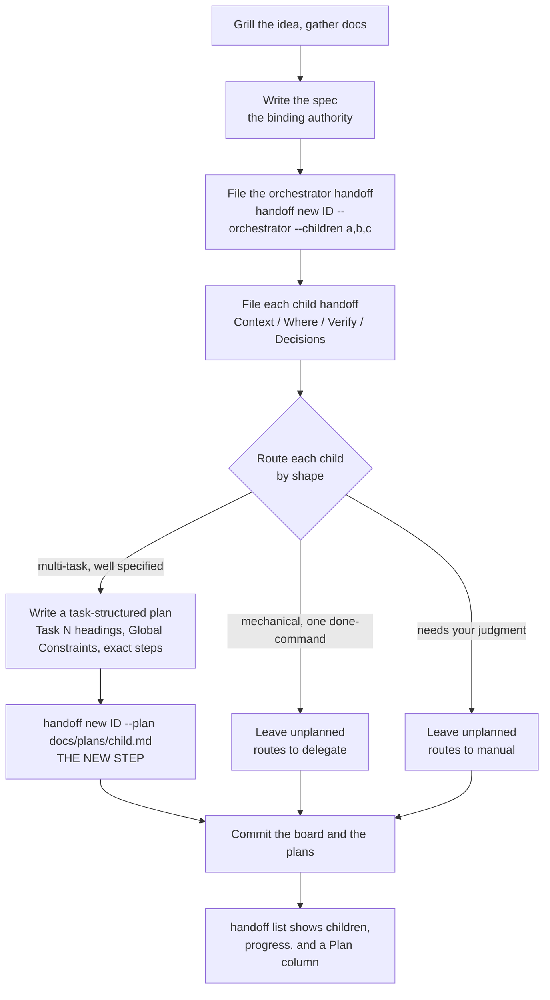
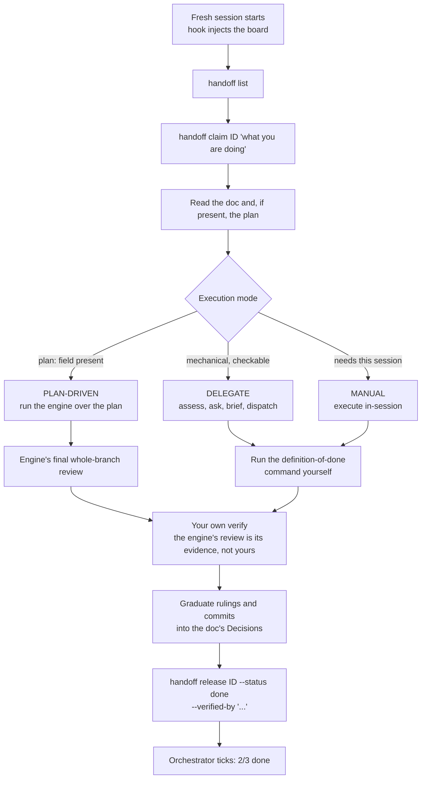
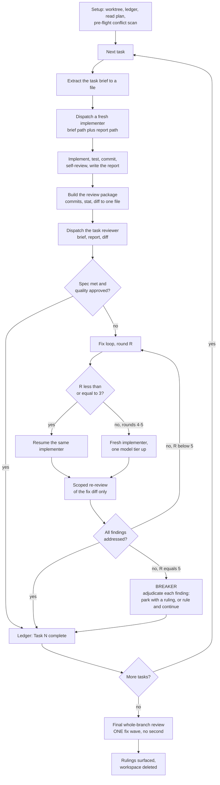
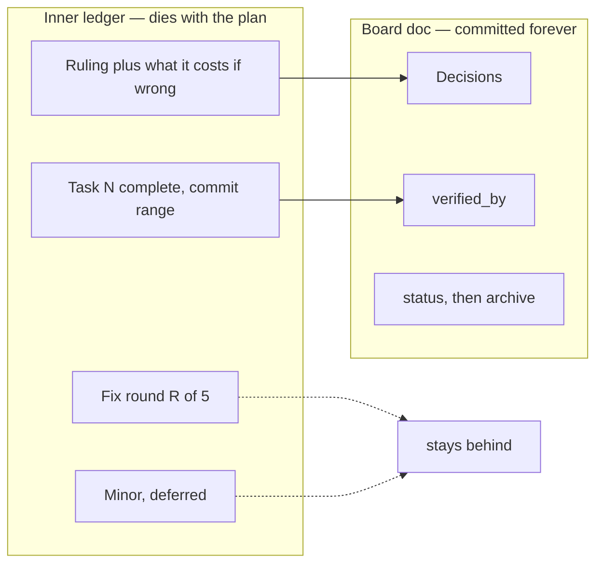

# Agent execution approaches — comparison reference

A durable comparison of the three approaches this repo's workflow can draw on, written so a
**fresh session can pick one group or one feature and go deep without replaying the analysis**.

Companion documents:

- [ADR-0001](adr/0001-handoff-plan-execution-integration.md) — the accepted decision to link
  handoffs to task-structured plans. Authoritative on concept.
- [plan-execution tradeoffs](plan-execution-tradeoffs.md) — the decision analysis behind ADR-0001
  and its open steering items.
- This document — the full axis-by-axis comparison and the feature-level adoption ledger.

Everything here is analysis, not a control document. Where it disagrees with the ADR or the design
spec, they win.

## How to use this in another session

Every group and feature has a stable id. To steer one, open a session and say which id you are
working on — for example "explore G5" or "implement F07".

A fresh session needs only this document plus, depending on the id:

| Working on            | Also read                                                                         |
| --------------------- | --------------------------------------------------------------------------------- |
| Any group             | [ADR-0001](adr/0001-handoff-plan-execution-integration.md)                        |
| G2, G3, G4            | `skills/engineering/run-handoff/SKILL.md`                                         |
| G2, G4, G5            | `skills/personal/run-delegate-agent/SKILL.md`                                     |
| Any F-id marked ADOPT | The target skill named in the ledger's "Lands in" column                          |
| G5 (cost)             | Nothing more — the model is self-contained, but it is estimates, not measurements |

The [Scoreboard](#scoreboard--which-is-better-per-group) answers "which is better" per group in
one table. [Workflow diagrams](#workflow-diagrams) is self-contained and safe to lift into a post.

## Subjects compared

| Id     | Subject                  | What it is                                                                                                                                                                                  |
| ------ | ------------------------ | ------------------------------------------------------------------------------------------------------------------------------------------------------------------------------------------- |
| **S1** | Plan-execution engine    | An external, subagent-driven plan executor. Fresh implementer per task, per-task spec and quality review, bounded fix loop, final whole-branch review. Reached by ADR-0001's `plan:` field. |
| **S2** | Delegate suite           | `register-delegate-agents`, `setup-delegate-agent`, `run-delegate-agent`. Dispatches mechanical work to a cheaper agent in a separate CLI process, under a consent gate.                    |
| **S3** | Handoff suite            | `setup-handoff`, `run-handoff`, `delegate-handoff`, `repair-handoff`, `register-cross-repo-handoff`. A lease-based, git-committed coordination board.                                       |
| **S4** | Harness permission modes | Plan mode and auto-accept mode. Included only to fix a category confusion — see G7.                                                                                                         |

The boundary each subject crosses is the fastest way to tell them apart:

- **S1** crosses a **context** boundary — fresh subagent, same session, same vendor, same instant.
- **S2** crosses a **process and party** boundary — a different CLI, possibly a different vendor.
- **S3** crosses a **time, session, repo, and person** boundary — durable by construction.

## Group index

| Id     | Group                | Question it answers                                |
| ------ | -------------------- | -------------------------------------------------- |
| **G1** | Category and scope   | What kind of thing is each, and what does it own?  |
| **G2** | Execution mechanics  | Who does the work, and what gates it?              |
| **G3** | State and durability | What survives, and for how long?                   |
| **G4** | Control and safety   | What stops a wrong action, and who decides?        |
| **G5** | Cost and tokens      | What does each path cost, and what are the levers? |
| **G6** | Lifecycle fit        | Where in the SDLC does each belong?                |
| **G7** | Category boundaries  | How do these differ from harness permission modes? |

---

## Scoreboard — which is better, per group

Not every group has a winner. Where three layers do different jobs, saying one "wins" would be
noise, so those are marked as such.

| Group                    | Best                                    | Why                                                                                                             |
| ------------------------ | --------------------------------------- | --------------------------------------------------------------------------------------------------------------- |
| **G1** Category          | ➖ no winner                            | Three layers, not three competitors. Each owns a different question.                                            |
| **G2** Mechanics         | 🏆 **S1 engine**                        | The only subject with an independent reviewer of the diff and a bounded fix loop. S2 and S3 self-verify.        |
| **G3** Durability        | 🏆 **S3 handoff**                       | The only record that survives session close, compaction, machine, and person. S1 deletes its own.               |
| **G4** Safety            | 🏆 **S2** egress, 🏆 **S3** concurrency | Both enforced by code that ignores permission modes. S1 is enforced by a controller choosing to comply.         |
| **G5** Cost              | ⚖️ depends on the scarce resource       | 💰 S2 cheapest in dollars · 🧠 S1 cheapest in main-session context per unit of quality · S3 near-free overhead. |
| **G6** Lifecycle fit     | ➖ no winner                            | Complementary by stage — the routing table is the answer, not a ranking.                                        |
| **G7** Category boundary | ➖ not applicable                       | Permission modes are a different kind of thing entirely.                                                        |

**The one-line answer:** ✅ use **S3** to know what exists and that it survives, ✅ **S1** to execute
one plan-shaped unit well, ✅ **S2** to make the mechanical parts cheap. The only real capability
gap left after ADR-0001 is ❌ no reviewer in delegate and manual modes (F02).

## G1 — Category and scope

➖ **No winner — different layers.** S3 owns _what and whether it survives_, S1 owns _how one
unit executes_, S2 owns _who does the mechanical parts_.

| Axis            | S1 engine                   | S2 delegate                              | S3 handoff                                 |
| --------------- | --------------------------- | ---------------------------------------- | ------------------------------------------ |
| Category        | Execution workflow (prose)  | Dispatch infrastructure                  | Coordination infrastructure                |
| Owns            | How a plan gets executed    | Who may do work, where, and at what cost | Whether work is tracked and survives       |
| Unit of work    | A task from a plan          | A mechanical chunk with a done-command   | A board item                               |
| Install surface | None (external)             | Dispatcher, adapters, hooks, cascade     | CLI, hook core, per-tool config, templates |
| Prerequisites   | A task-structured plan file | trivy, python3, jq, a declared roster    | git, bash, python3 for hard enforcement    |
| Vendor coupling | Its own harnesses           | None                                     | None                                       |

**Reading:** these are three layers, not three competitors. S3 says _what_ is being worked and
whether it survives; S1 says _how_ one unit gets executed this session; S2 says _who_ does the
mechanical parts inside it.

---

## G2 — Execution mechanics

🏆 **Best — S1 engine.** It is the only one that puts an adversarial reader on the diff and bounds
the fix cycle. ❌ S2 and S3 both verify by self-report.

| Axis                     | S1 engine                             | S2 delegate                        | S3 handoff                          |
| ------------------------ | ------------------------------------- | ---------------------------------- | ----------------------------------- |
| Who writes code          | Fresh implementer subagent            | A separate CLI process             | Whoever holds the lease             |
| Worker context isolation | Subagent, constructed per task        | Whole separate process             | Whole separate session              |
| Independent review       | Yes — reviewer seat per task          | None                               | None                                |
| Fix loop                 | Bounded rounds, model escalation      | Ask-back cap only                  | None                                |
| Final review             | Whole-branch, top model, one fix wave | None                               | Release-time verify by the holder   |
| Steering granularity     | Per-plan, then hands-off              | Per-dispatch                       | Per-claim                           |
| Ask-back path            | Implementer asks, controller answers  | `needs_input` then resume          | Not applicable                      |
| Parallelism              | Forbidden for implementers            | One dispatch at a time in practice | Many sessions, serialized by leases |

**Reading:** S1 is the only subject with an adversarial reader of the diff. S2 and S3 both verify
by self-report — the dispatcher's own done-command, the lease holder's own `--verified-by`. That
is the single largest capability difference across the three, and it is why ADR-0001 routes to an
engine rather than reimplementing one.

---

## G3 — State and durability

🏆 **Best — S3 handoff.** ✅ Committed, indexed, archived. ⚠️ S1's ledger is excellent but deletes
itself on success. ❌ S2 keeps files nothing indexes.

| Axis                   | S1 engine                    | S2 delegate                        | S3 handoff                                                     |
| ---------------------- | ---------------------------- | ---------------------------------- | -------------------------------------------------------------- |
| Working record         | Per-plan ledger, git-ignored | Per-dispatch result, raw, log      | The doc itself                                                 |
| Deleted when           | On successful completion     | Not managed                        | Never — archived on `done`                                     |
| Survives compaction    | Yes, until deleted           | No                                 | Yes                                                            |
| Survives session close | Only what was copied out     | Files remain, nothing indexes them | Yes                                                            |
| Survives machine       | No                           | No                                 | Yes — committed                                                |
| Progress at a glance   | Re-read the ledger           | None                               | `handoff list`                                                 |
| Cross-links            | Plan file to ledger          | Brief to result                    | Doc to plan (ADR-0001), doc to brief, orchestrator to children |

**Reading:** S1's ledger and S3's board solve the same compaction problem at different lifetimes.
Keep both, with a graduation rule — see X3.

---

## G4 — Control and safety

🏆 **Best — S2 for egress, S3 for concurrency.** Both are hooks and refusals in code, so a
permission-mode change cannot switch them off. ❌ S1 has neither concept.

| Axis                     | S1 engine                  | S2 delegate                                                   | S3 handoff                     |
| ------------------------ | -------------------------- | ------------------------------------------------------------- | ------------------------------ |
| Enforcement mechanism    | Prose only                 | Dispatcher refusals plus a consent hook                       | A hook that denies the edit    |
| Survives a mode change   | Not applicable             | Yes — a hook is not a permission mode                         | Yes                            |
| Human approval           | Removed by design          | Required, recorded as an artifact                             | Implicit in claim and release  |
| Egress and party control | None                       | Full — party classes, both-way scanning, never-delegate paths | None                           |
| Multi-worker collision   | Avoided by rule            | Not applicable                                                | Prevented by lease             |
| Blast radius limiter     | Worktree                   | Worktree, narrow allowlist, budgets                           | Lease plus a reviewable record |
| Refuses outright         | Four named stop conditions | `bypassPermissions`, widened allowlist, secrets               | Editing a doc you do not hold  |

**Reading:** S2 and S3 are enforced by code that runs regardless of what mode anyone is in. S1 is
enforced by a controller choosing to comply. When composing them, the coded gate always wins — see
X1.

---

## G5 — Cost and tokens

⚖️ **Depends on which resource is scarce.** 💰 dollars → S2. 🧠 main-session context → S1.
⏱️ overhead → S3. Optimizing "tokens" as a single number steers wrong.

The full model, worked examples, and optimization levers live in
[plan-execution tradeoffs](plan-execution-tradeoffs.md#cost-model). Summary only here.

| Path                         | Tokens   | Dollars      | Main-session context |
| ---------------------------- | -------- | ------------ | -------------------- |
| Manual in-session (baseline) | 1.0x     | 1.0x         | 100%                 |
| Engine, clean task           | 2.5-3.5x | 2.5-3.5x     | 10-20%               |
| Engine, batched              | 1.2-1.5x | 1.2-1.5x     | ~10%                 |
| Delegate, cheaper tier       | 1.2-2x   | 0.2-0.6x     | 15-25%               |
| Delegate, local model        | 1.2-2x   | ~0x marginal | 15-25%               |
| Handoff envelope overhead    | +2-5k    | 1.02-1.05x   | ~5%                  |

Three rules that follow:

1. Tokens and dollars diverge once the model tier changes. Optimize them separately.
2. Main-session context is the scarce resource, not dollars.
3. The reviewer seat is roughly 30-40% of the engine's cost. Independent review has a price; know
   it before deciding a mode does not need one.

These are structural estimates from seat and turn counts, not measurements. The first real
plan-driven handoff is where they become numbers.

---

## G6 — Lifecycle fit

➖ **No winner — complementary.** The routing table replaces the ranking.

| Stage                                       | Route                                               |
| ------------------------------------------- | --------------------------------------------------- |
| Design and decompose                        | Spec, then orchestrator plus child handoffs         |
| Child is multi-task and well specified      | Plan-driven — the engine                            |
| Child is mechanical with one checkable done | Delegate                                            |
| Child needs this session's judgment         | Manual                                              |
| Any of the above                            | The lease wraps it, always                          |
| Work leaves the board entirely              | `delegate-handoff` — export, then import the result |
| Returning later                             | `handoff list`                                      |

---

## G7 — Category boundaries

➖ **Not comparable.** Permission modes gate _what tool calls are allowed_; the engine prescribes
_what you do with the calls you are allowed_.

Included because it is the most common confusion. Plan mode and auto-accept mode are **harness
permission states**; the engine is a **workflow prescription**. They are orthogonal.

| Axis          | Plan mode           | Auto-accept mode   | S1 engine               |
| ------------- | ------------------- | ------------------ | ----------------------- |
| What it is    | A permission state  | A permission state | Prose instructions      |
| Enforced by   | The harness         | The harness        | Nothing                 |
| Who does work | Main session        | Main session       | Subagents               |
| The gate is   | The human, once     | Nothing            | Another agent, per task |
| Produces      | A plan for approval | Nothing            | A reviewed branch       |

Two consequences worth remembering:

- Plan mode occupies the slot _before_ the engine, not instead of it. Its output must be written
  to a file with the plan format the engine expects before the engine can consume it.
- Auto mode says "you may act without asking." The engine says "you must decide without asking."
  The second is stronger, which is why the engine owes a record of every decision it took on your
  behalf — see F07.

---

## Where the ledger and the loops live

The two features most worth understanding, because they are what makes long work resumable.

### 📒 The three ledgers

| Ledger              | Where                                                                               | Written by                                    | Lifetime                                                          | Read when                                  |
| ------------------- | ----------------------------------------------------------------------------------- | --------------------------------------------- | ----------------------------------------------------------------- | ------------------------------------------ |
| **Inner** (engine)  | `.superpowers/sdd/<plan-basename>/progress.md`, git-ignored by a self-ignoring file | The engine's controller, one line per event   | ✅ Survives compaction, ❌ deleted when the final review is clean | At engine start, to resume mid-plan        |
| **Board** (durable) | `.agents/handoff/<id>-handoff.md` plus the generated `INDEX.md`                     | The `handoff` CLI — `new`, `claim`, `release` | ✅ Forever; archived on `done`                                    | `handoff list`, and the session-start hook |
| **Delegate**        | ❌ none — only per-dispatch `.result`, `.raw`, `.log`                               | The dispatcher                                | Untracked                                                         | Only when triaging one failure             |

The inner ledger is a flat append-only file. Its line shapes are the whole mechanism:

```text
# SDD ledger — plan: docs/plans/my-plan.md
Task 2: fix round 1/5 (2 addressed, 0 open; commits d4e5f6a..b7c8d9e)
Task 2: complete (commits d4e5f6a..b7c8d9e, review clean)
Task 3: minor (deferred): magic number left in the retry path
Task 4: parked — reviewer flagged duplication — Ruling: the plan mandates it, cost if wrong is one refactor
```

Why it exists: conversation memory does not survive compaction, and a controller that loses its
place has been observed re-dispatching entire completed task sequences. The ledger plus `git log`
is the recovery map — after compaction, trust them over recollection.

**The gap this exposes:** the inner ledger is deleted on success, so its `Ruling:` lines vanish
with it. That is [F07](#feature-adoption-ledger) and open item 2 in the tradeoffs document.

### ♻️ The four loops

Four distinct loops run at different altitudes. Conflating them is the most common source of
confusion about how this fits together.

| Loop              | Lives in                                | Trigger                                                                        | Bound                       | Exit                                     |
| ----------------- | --------------------------------------- | ------------------------------------------------------------------------------ | --------------------------- | ---------------------------------------- |
| **Board loop**    | The `handoff` CLI                       | Starting tracked work                                                          | The lease TTL, auto-renewed | `release` with an honest status          |
| **Task loop**     | The engine                              | Each task in the plan                                                          | The number of tasks         | Every task marked complete               |
| **Fix loop** 🔁   | The engine, nested inside the task loop | Spec fail, any Critical or Important finding, or a confirmed unverifiable item | **5 rounds**                | A clean scoped re-review, or the breaker |
| **Ask-back loop** | The delegate dispatcher                 | The worker returns `needs_input`                                               | **3 rounds** (configurable) | An answer, or a re-brief                 |

### 🔁 The fix loop in detail

This is the piece worth copying into a devblog, because it is where quality actually comes from.

1. **Rounds 1-3 — resume the original implementer.** Its context is intact; it knows the task, the
   code, and its own choices. Send the open findings verbatim.
2. **Rounds 4-5 — fresh implementer, one model tier up.** A loop that survives three resumes
   usually means the implementer cannot see its own problem. Fresh eyes plus a capability bump in
   one move.
3. **Every round ends in a scoped re-review** over the fix diff only. It verdicts each finding
   addressed or not addressed and flags new breakage in that diff. It cannot wander.
4. **At round 5 the breaker trips.** Stop dispatching and adjudicate each open finding: park it
   with a ruling, or — if it is real and something downstream builds on it — rule on the smallest
   change that unblocks the dependent work. Every adjudication is a ledger line; a silent discard
   is forbidden.

⚠️ Two adaptations this repo's suites require: escalation goes **inward**, not across a party
boundary ([X2](#standing-conflicts)), and the consent gate takes precedence over the engine's
continuous-execution rule ([X1](#standing-conflicts)).

---

## Workflow diagrams

Lift these straight into a devblog. They describe the flow ADR-0001 enables.

### Session 1 — design and decompose

Your steering session. ADR-0001 extends it by exactly one step: setting `--plan` on the children
that are plan-shaped.



### Session 2+ — execute, one fresh session per child



### The execution loop, inside plan-driven mode



### What graduates from the inner ledger to the board



⚠️ The dotted edges are correct and deliberate. A child that writes its whole trace upward turns
the board into a transcript dump, which is a different way of being lost.

---

## Feature adoption ledger

Scored against the **accepted** ADR-0001. Because a plan-driven handoff routes to the engine, many
features arrive with it rather than needing to be built.

Verdicts:

- **ENGINE** — provided by the engine in plan-driven mode. Still absent in delegate and manual
  modes, which is where a gap remains.
- **HAVE** — already in the suite, at parity or better.
- **ADOPT** — worth adding to the suite; usually prose, sometimes a small artifact.
- **SKIP** — deliberately not adopted, with the reason.

| Id      | Feature                                                             | Verdict | Lands in / note                                                                             |
| ------- | ------------------------------------------------------------------- | ------- | ------------------------------------------------------------------------------------------- |
| **F01** | Review package — commits, stat, diff to one file                    | ENGINE  | Small enough to lift standalone if delegate mode ever needs a reviewer                      |
| **F02** | Reviewer seat, spec plus quality verdicts                           | ENGINE  | **The remaining gap for delegate and manual modes**                                         |
| **F03** | Scoped re-review of a fix diff                                      | ENGINE  | Only meaningful together with F04                                                           |
| **F04** | Fix loop with a round cap                                           | ENGINE  | A two-round version would fit `run-delegate-agent`'s existing re-brief-once rule            |
| **F05** | Escalate to a stronger model on late rounds                         | SKIP    | Would cross a party boundary the cascade draws on purpose. Escalate inward instead          |
| **F06** | Treat the worker's report as unverified claims, rationales included | ADOPT   | `run-delegate-agent` verify step, `run-handoff` release step                                |
| **F07** | Rulings recorded with what they cost if wrong                       | ADOPT   | `run-handoff` — graduate into the doc's Decisions section. Open item 2 in the tradeoffs doc |
| **F08** | Batch small same-shape work into one dispatch                       | ADOPT   | `run-delegate-agent` assessment step. Largest single cost lever                             |
| **F09** | Workers never dispatch their own subagents                          | ADOPT   | The delegate brief contract                                                                 |
| **F10** | Diff from a recorded base, never one commit back                    | ADOPT   | Any multi-commit diff. Silent-truncation class                                              |
| **F11** | Final whole-branch review                                           | ENGINE  | Consider for high-severity handoffs in other modes                                          |
| **F12** | Turn count beats token price when tiering models                    | ADOPT   | `register-delegate-agents` rank guidance, one paragraph                                     |
| **F13** | Pre-flight cross-task conflict table                                | ENGINE  | Plan-scoped; the engine owns the plan                                                       |
| **F14** | Extract one task's text to a brief file                             | ENGINE  | Same                                                                                        |
| **F15** | Per-plan git-ignored workspace                                      | SKIP    | Briefs are committed on purpose so a PR shows the report beside the code                    |
| **F16** | A ledger that survives compaction                                   | HAVE    | The board, and it is durable where the engine's is not. Delegate still has none             |
| **F17** | Fresh worker with constructed context                               | HAVE    | Separate process beats subagent                                                             |
| **F18** | Explicit model selection per unit of work                           | HAVE    | The cascade, with party classes the engine has no concept of                                |
| **F19** | Structured status contract from the worker                          | HAVE    | Schema-enforced JSON rather than prose statuses                                             |
| **F20** | Brief as a file, with no conversational back-reference              | HAVE    | Both suites arrived at this independently                                                   |
| **F21** | Continuous execution without checking in                            | SKIP    | Head-on conflict with the consent gate. See X1                                              |
| **F22** | Worktree isolation for anything that writes                         | HAVE    | Delegate's worktree flag                                                                    |

**The short read:** after ADR-0001, the only capability gap left is **F02 for the delegate and
manual modes** — a plan-driven handoff gets a reviewer, the other two do not. Everything else is
either arriving with the engine, already present, or deliberately declined.

---

## Composition model

```text
handoff   what is being worked, by whom, and does it survive     durable, cross-session
  engine  how one claimed plan-shaped unit gets executed          ephemeral, reviewed
  delegate who does the mechanical sub-parts                      cheap, gated
```

Two levels, two ledgers, one graduation rule. The outer level is the board and lives forever. The
inner level is the engine's ledger and dies with the plan. What crosses from inner to outer is
**commits, evidence, and rulings** — never the task-by-task trace.

## Standing conflicts

| Id     | Conflict                                                  | Resolution                                                                                                                         |
| ------ | --------------------------------------------------------- | ---------------------------------------------------------------------------------------------------------------------------------- |
| **X1** | The engine's continuous execution versus the consent gate | The gate wins. Approve once per handoff, covering the class and the narrowest allowlist the unit needs, rather than once per task. |
| **X2** | Late-round model escalation versus party discipline       | Escalate inward, not sideways — back to the primary session's own vendor, never across a party boundary.                           |
| **X3** | Two ledgers                                               | Keep both with different jobs. Only commits, evidence, and rulings graduate to the board.                                          |

## Where this analysis is weakest

- **G5 is estimated, not measured.** Seat and turn counts come from reading the engine's own
  definitions. Instrument the first plan-driven handoff and replace the ratios.
- **F02's scope depends on how good the engine's review actually is.** Do not build a second
  reviewer seat until a real run shows the engine's is insufficient.
- **The engine is external.** Its behavior can change under you. The `plan:` link is deliberately
  content-blind, so the exposure is documentary rather than mechanical, but a format change
  upstream would still land on the plan files you write.
