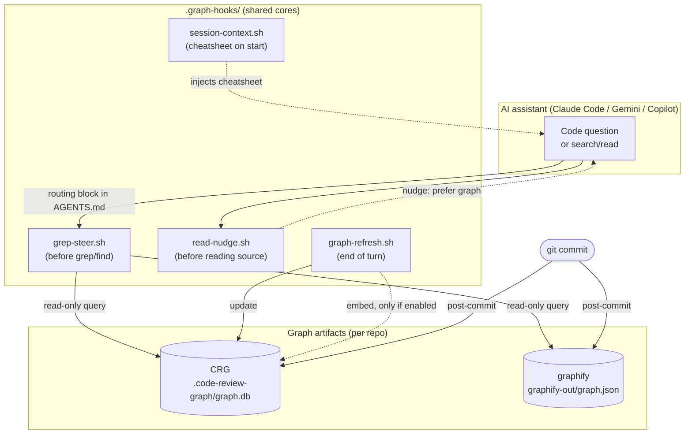
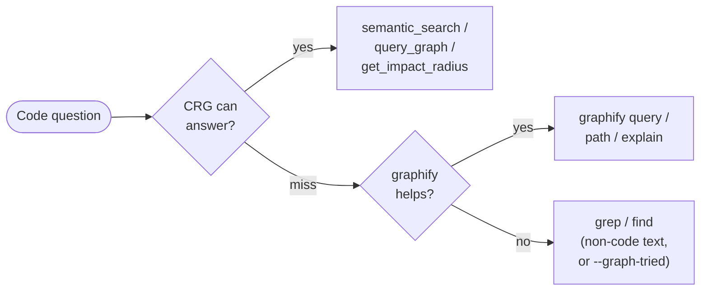
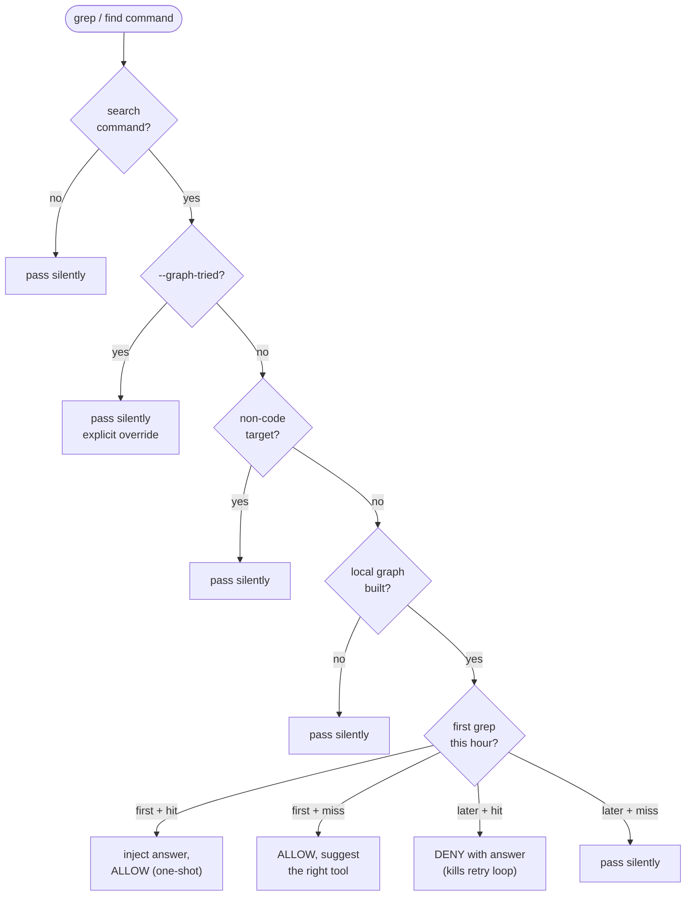
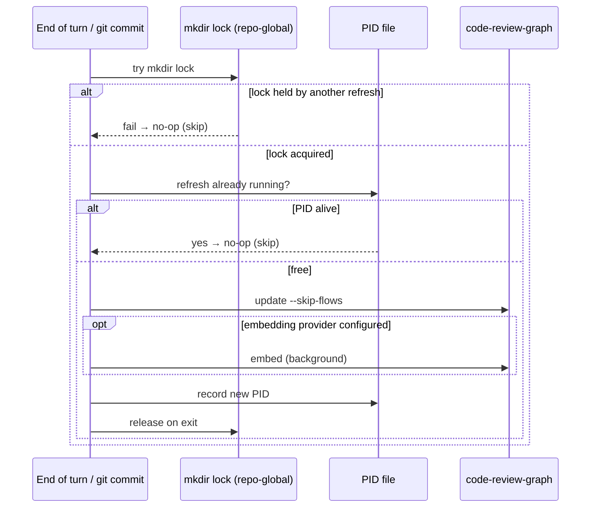
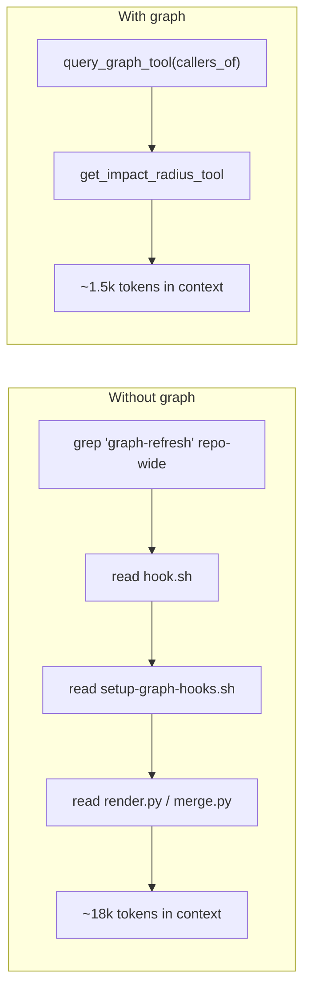

# How the graph tools work during development

This repo carries a **self-updating code knowledge graph** so AI assistants answer code
questions by querying a structural index instead of grepping and re-reading source files.
Two tools back that index, and a layer of hooks keeps them fresh and steers every agent
toward them. This document explains what happens while you (and the assistant) actually
work — what fires, when, and how to get out of the way when you need to.

The graph layer is installed and maintained by a small family of skills; this doc is the
**runtime view** of what they wire up:

| Skill                                                                                                    | Role                                                                                                                                                           |
| -------------------------------------------------------------------------------------------------------- | -------------------------------------------------------------------------------------------------------------------------------------------------------------- |
| [`setup-graph-hooks`](../skills/engineering/setup-graph-hooks/SKILL.md)                                  | Wire the hooks, routing block, and refresh — first-time setup.                                                                                                 |
| [`repair-graph-hooks`](../skills/engineering/repair-graph-hooks/SKILL.md) _(experimental)_               | Diagnose and fix a broken/stale/drifted graph layer after a `verify` `[FAIL]` or misbehaving tools.                                                            |
| [`register-cross-repo-graph`](../skills/engineering/register-cross-repo-graph/SKILL.md) _(experimental)_ | Declare sibling repos in a committed `.graph-repos.json` cascade, then sync: read-only access to their graphs, with the in-scope list recorded in `AGENTS.md`. |

## The two tools

|                 | **code-review-graph (CRG)**                                     | **graphify**                                                 |
| --------------- | --------------------------------------------------------------- | ------------------------------------------------------------ |
| Surface         | MCP tools (`semantic_search_nodes_tool`, `query_graph_tool`, …) | CLI (`graphify query/path/explain`)                          |
| Artifact        | `.code-review-graph/graph.db` (SQLite + FTS5)                   | `graphify-out/graph.json`                                    |
| Best at         | symbol search, impact/blast-radius, review context              | neighborhood exploration, shortest path A→B, concept explain |
| Refresh trigger | primary tool's end-of-turn hook **+** git `post-commit`         | git `post-commit` (single owner)                             |
| Role in routing | **first** choice                                                | fallback on a CRG miss                                       |

Both are **optional and dormant until built**. Every hook `command -v`-checks its tool and
silently no-ops when the tool or its artifact is absent — the repo is safe with neither
installed. Install with `pipx install code-review-graph` and `pipx install graphifyy` (note
the double `y`: the PyPI package is `graphifyy`, the command it installs is `graphify`).

## How it fits together



The hooks are the glue: they steer the agent _toward_ the artifacts on the read path and keep
those artifacts _fresh_ on the write path — the agent never has to think about either.

## The routing rule agents follow

The `<!-- graph-hooks -->` block in [AGENTS.md](../AGENTS.md) (reached by every tool via its
`@AGENTS.md` import) tells assistants to prefer the graph **before** grep/find/glob or reading
many files. The decision order is **CRG first, graphify on a miss, grep last**:

| Need                            | Use                                                         |
| ------------------------------- | ----------------------------------------------------------- |
| where is X defined              | `semantic_search_nodes_tool(query=X)`                       |
| who calls / imports X           | `query_graph_tool(pattern=callers_of\|importers, target=X)` |
| pre-refactor blast radius       | `get_impact_radius_tool(changed_files=[...])`               |
| code review / PR impact         | `get_review_context_tool(changed_files=[...])`              |
| architecture overview           | `list_communities_tool()`                                   |
| CRG miss / neighborhood explore | `graphify query '<term>' --graph graphify-out/graph.json`   |
| shortest path A→B               | `graphify path '<A>' '<B>' --graph graphify-out/graph.json` |
| string / config / log text      | `grep` (append `--graph-tried` to bypass the gate)          |

The graph indexes **code symbols** — functions, classes, imports, call edges. It does _not_
index `.md`, `.json`, `.yml`, `.log`, or config text. For those, grep is correct and the hooks
step out of the way.

`semantic_search_nodes_tool` answers whether or not this repo enabled vector embeddings: with an
empty embeddings table CRG falls back to keyword search over symbol names. That is a quality
difference (worse tolerance for paraphrased queries), not an availability one — see
[Semantic search is optional](#semantic-search-is-optional).



## What fires while you work

Three hook behaviors run per session, plus a refresh. They are the same protocol-free cores
across Claude Code, Gemini CLI, and Copilot; only the wrapping differs per tool.

### 1. Session start — the cheatsheet

When a session opens, a `SessionStart` hook injects a short query cheatsheet and the current
graph stats (node/edge/file counts, last-updated commit) into context. This is why the
assistant knows the graph exists and how to query it without you saying so.

### 2. Before a grep/find — grep steering

When the assistant (or you, through it) runs a search command, `grep-steer.sh` applies a
four-tier ladder (first match wins):

1. **Not a search command** (`grep`/`rg`/`find`/`fd`/`ack`/`ag`) → pass silently.
2. **Command contains `--graph-tried`** → pass silently. This is the explicit override.
3. **Target is non-code** (`.md`, `.json`, `.yml`, `.log`, `node_modules`, `dist/`, …) → pass
   silently.
4. **No local graph built** → pass silently.
5. **Graph present** — one allowance per repo per hour:
   - first grep + graph **hit** → inject the answer, **allow** the grep (a one-shot lesson);
   - first grep + **miss** → allow, and suggest the right tool for next time;
   - later grep + hit → **deny** with the answer inline (this is what kills the grep-retry loop);
   - later grep + miss → pass silently.

So the graph gets a chance to pre-answer a code-symbol search before the grep runs, but it
never blocks a search it can't answer, and never blocks non-code text.



### 3. Before reading source — read nudge

When the assistant is about to `Read`/glob a **source file** (`.py`, `.ts`, `.go`, `.rs`, …),
`read-nudge.sh` injects a reminder to prefer the graph tools for _understanding_ code, while
explicitly noting: **read raw files to modify or debug specific code.** It only nudges — it
never blocks a read — and it ignores the graph artifacts themselves.

> You'll see these nudges in this very session as `PreToolUse:Read hook additional context`
> lines. That is the read-nudge doing its job.

### 4. End of turn + git commit — refresh

Keeping the graph current is the whole point, and it's arranged so N wired tools never trigger
N rebuilds:

- **Primary tool, end of turn.** Exactly one tool (chosen at setup as `--primary`) runs
  `graph-refresh.sh` when a turn finishes. It launches `code-review-graph update --skip-flows` in
  the background, then `embed` **only if this repo configured an embedding provider** — the gate
  is `.graph-hooks/core/embed-provider.sh`, which prints nothing in keyword mode.
- **Git `post-commit`, always.** A commit refreshes the graph regardless of which tool — or no
  tool — is driving. graphify refreshes from here as its single owner.

Both paths are guarded against races by a **repo-global `mkdir` lock** (portable — macOS has no
`flock`) plus a PID file: a second concurrent refresh no-ops instead of racing the update. You
do not need to rebuild the graph by hand after editing.



## Scenarios: token cost and efficiency

The payoff is measured in **context tokens the assistant burns to answer** — the graph returns
a few compact rows (`kind  name  -> file:line`) where grep-and-read pulls whole files into
context. The numbers below are **order-of-magnitude estimates** for a mid-size repo
(~40 files, this repo's own graph is 98 nodes / 1,068 edges); they scale with repo size and the
model, but the _ratio_ holds. A graph query result is typically 200–1,000 tokens regardless of
repo size; the grep/read path grows with the codebase.

| Scenario                                                  | Without graph (grep + read)                                      | With graph                                                        | Approx. saving |
| --------------------------------------------------------- | ---------------------------------------------------------------- | ----------------------------------------------------------------- | -------------- |
| **Locate a symbol** — "where is `foo` defined?"           | grep, then read 2–3 candidate files to confirm → **3k–8k**       | `semantic_search_nodes_tool(query=foo)` → **~0.3k–0.6k**          | ~90%           |
| **Find callers** — "who calls `foo`?" before changing it  | grep the name repo-wide, read each caller file → **10k–25k**     | `query_graph_tool(pattern=callers_of, target=foo)` → **~0.5k–1k** | ~95%           |
| **Blast radius** — pre-refactor impact of touching a file | trace imports by hand, read the dependency fan-out → **20k–50k** | `get_impact_radius_tool(changed_files=[…])` → **~1k–2k**          | ~95%           |
| **Review a changeset / PR**                               | read every changed file + its dependents → **15k–40k**           | `detect_changes_tool` + `get_review_context_tool` → **~2k–4k**    | ~85%           |
| **Get oriented** — "what are the main modules?"           | read README, walk dirs, sample many files → **30k–80k**          | `list_communities_tool()` → **~1.5k–3k**                          | ~95%           |
| **Trace a path** — "how does A reach B?"                  | grep + follow the call chain across files → **8k–15k**           | `graphify path 'A' 'B'` → **~0.5k–1k**                            | ~90%           |

### Worked example: "who calls `graph-refresh.sh` and what breaks if I change it?"



Same answer, ~12× less context consumed — and the graph also surfaces the _test_ coverage and
transitive dependents that a first-pass grep would miss.

### Performance & efficiency characteristics

- **Query latency is near-zero.** Reads hit a local SQLite DB (CRG, with an FTS5 index) or a
  local JSON file (graphify) — sub-second, no network. Contrast with grep-then-read, whose cost
  is dominated by the model re-ingesting file contents.
- **Refresh is background and non-blocking.** `graph-refresh.sh` launches
  `update --skip-flows` detached (`nohup … &`); your turn doesn't wait on it.
- **Refresh is incremental, not a full rebuild.** `update` re-parses only what changed via
  Tree-sitter (AST parsing — no LLM/API cost), and `embed` is incremental too: `embed_nodes()`
  hashes each node's text and skips rows whose hash and provider are unchanged.
- **The embed's recurring cost is the import, not the inference.** CRG decides whether the local
  provider is usable by `import sentence_transformers`, which pulls in torch — and it does that
  _before_ the hash check can discover there is nothing to re-embed. So a no-op embed still costs
  a torch import. That is exactly why the refresh skips `embed` entirely when no provider is
  configured, instead of firing one and discarding the error.
- **No redundant builds.** The single-owner rule (one `--primary` tool) plus the repo-global
  `mkdir` lock and PID file collapse N tools / concurrent sessions to **one** refresh — the rest
  no-op. Without this, N wired tools would each trigger a rebuild.
- **Read-path throttle.** The grep-steerer's "one allowance per repo per hour" means it
  pre-answers or denies at most once per hour per repo, so it never turns into nagging — the
  first grep teaches, later duplicate greps get the cached answer inline.
- **Freshness is the one trade-off.** Between an edit and the next refresh the graph can lag by a
  turn (or until the next commit). For code you just wrote and are actively debugging, read the
  raw file — the read-nudge explicitly tells the assistant to do exactly that.

> These are estimates for reasoning about _relative_ cost, not a benchmark. Actual savings
> depend on repo size, question type, and how many files a naive grep would pull in — the win
> grows as the codebase grows, because the graph answer stays flat while the grep/read answer
> does not.

## Your escape hatches

- **Bypass the grep gate for one command:** append `--graph-tried` to it. The steerer passes it
  through untouched. Use this when you genuinely want to grep code text (a string literal, a log
  line inside source) that the symbol graph won't have.
- **Non-code searches never need a bypass** — `.md`/`.json`/`.yml`/`.log`/config paths are
  already exempt.
- **Reading to edit or debug is fine** — the read-nudge is advisory. Open the file.
- **No graph installed?** Everything above no-ops. Nothing breaks; you just don't get the
  pre-answers.

## Building and checking the graph

One-time build (only if you've installed the tools):

```bash
# CRG (recommended): MCP tools + graph search
code-review-graph install && code-review-graph build
# graphify (optional): CLI exploration + git-hook freshness
graphify update . && graphify hook install
```

Verify the hooks are wired and firing:

```bash
bash skills/engineering/setup-graph-hooks/scripts/verify-graph-hooks.sh .
```

A healthy result is **0 failed** — warnings only mean a tool or graph isn't built yet.

## Semantic search is optional

A built graph answers every MCP tool, including `semantic_search_nodes_tool`. Vector embeddings
are a separate, opt-in tier: without them CRG's `semantic_search` falls back to keyword search
over symbol names. Nothing errors, and no hook fires an `embed`.

Enable it when you want the tool to tolerate paraphrased queries ("where do we handle auth
retries") rather than name-shaped ones. Pick a route with:

```bash
bash skills/engineering/setup-graph-hooks/scripts/setup-embeddings.sh --list # what can this machine do?
bash skills/engineering/setup-graph-hooks/scripts/setup-embeddings.sh        # choose
```

**1. Local provider — the default, and the only one that works transparently.** Model
`all-MiniLM-L6-v2`, offline after the first run.

```bash
pipx inject code-review-graph sentence-transformers # pulls PyTorch, roughly 2 GB
code-review-graph embed
```

Nothing else to configure: CRG's default provider _is_ `local`, so both the refresh hooks and
the MCP server pick these vectors up on their own.

**2. Ollama — no PyTorch, but two extra wires.** Ollama serves an OpenAI-compatible
`/v1/embeddings` endpoint, so CRG's `openai` provider drives it locally. The setup script detects
a running daemon and lists only its embedding-capable models (it asks `/api/show` for a
`capabilities` array rather than guessing from the name), then writes the config for you.

```bash
ollama pull qwen3-embedding
bash skills/engineering/setup-graph-hooks/scripts/setup-embeddings.sh --provider ollama
```

CRG treats a `localhost` base URL as non-cloud, so this path prints no egress warning and needs
no `CRG_ACCEPT_CLOUD_EMBEDDINGS=1`. Nothing leaves the machine.

The catch is the **read path**. Writing vectors and reading them are different processes:

- The MCP server needs `CRG_OPENAI_*` in **its own** environment — the refresh hooks' `embed.env`
  is invisible to it, and CRG's OpenAI provider raises `ValueError` without those vars, which
  `semantic_search` swallows into a keyword-mode answer. `setup-embeddings.sh` writes them into
  `.mcp.json`'s `env` block for a localhost endpoint; **restart the server** afterwards.
- The tool's `provider` argument defaults to `local` and never consults the environment, so a
  default call ignores `openai:` vectors even with the env set. Pin it explicitly:

  ```text
  semantic_search_nodes_tool(query=…, provider="openai", model="qwen3-embedding")
  ```

Skip either wire and you get a graph full of embeddings that nothing reads —
`verify-graph-hooks.sh` warns when it sees exactly that.

Neither route is uniformly lighter — they move the cost. The local model is 22M parameters and
embeds a short synthetic identifier string per node (the dotted `Parent.name`, the name split
into words, the module directory, the language — never source bodies), so per-node compute is
negligible on any machine that can run an editor. What you pay for is a ~2 GB install and a
one-time model fetch. Ollama skips both, but keeps a multi-GB model resident in its daemon and
serves wider vectors (`qwen3-embedding` returns 4,096 dimensions against MiniLM's 384), so the
`embeddings` table grows accordingly.

Your choice is written to `.code-review-graph/embed.env` — repo-local, not shell-local, because a
commit made from a GUI git client inherits no shell rc and would otherwise stop refreshing your
vectors. That directory's `.gitignore` is `*`, so the file is never committed. Once set, the
hooks keep the vectors fresh with the provider recorded in the graph. Turn it back off with
`setup-embeddings.sh --provider off`.

## When the graph misbehaves

If the graph returns empty/stale results, the MCP tools error, a hook never fires, or
`verify-graph-hooks.sh` reports a `[FAIL]`/`[warn]`, don't hand-patch it —
run [`repair-graph-hooks`](../skills/engineering/repair-graph-hooks/SKILL.md) _(experimental)_.
It goes further than the read-only verifier: it **smoke-tests that the tools actually run**
(a present-but-broken `code-review-graph` binary fails every downstream fix silently), then adds
graph-state probes the verifier lacks — staleness vs `HEAD`, DB integrity / zero-node, partial or
unrefreshable embeddings, ignore-file drift, exec-bit/CRLF breakage, and stale refresh locks — before applying
safe, idempotent wiring repairs and _offering_ (never auto-running) the heavy rebuild. On a
healthy repo it is a clean no-op.

Common cases it fixes:

- A tool was dropped from a later setup, leaving a stale end-of-turn refresh owner → **duplicate
  graph builds**.
- A new-machine or Windows checkout where the exec bit or CRLF broke a hook.
- `code-review-graph` / `graphify` was reinstalled, upgraded, or moved and is now broken.

## Cross-repo lookups

Each repo owns and refreshes **its own** graph (single-writer), so nothing is shared across
folders until you declare it. To let a session in one repo _read_ another repo's graph — instead of
grepping across the folder boundary — use
[`register-cross-repo-graph`](../skills/engineering/register-cross-repo-graph/SKILL.md)
_(experimental)_.

You do not register repos by hand. **Scope is declared in a `.graph-repos.json` manifest** that
cascades exactly like `AGENTS.md` — user (`~/.code-review-graph/graph-repos.json`) → repo root →
subdirectory, nearest wins. The project layer is committed, so the sibling list is team-shared. A
relative `path` resolves against _the manifest that declared it_, which is what lets a committed
`"../acme-api"` mean the same checkout on every teammate's machine.

```bash
# 1. declare the scope (committed; a monorepo package may narrow it with its own manifest)
cp "$SKILL/assets/graph-repos.example.json" .graph-repos.json

# 2. preview, then apply — one script does both backends
bash "$SKILL/scripts/sync-cross-repo-graph.sh" . --dry-run
bash "$SKILL/scripts/sync-cross-repo-graph.sh" .
bash "$SKILL/scripts/verify-cross-repo-graph.sh" .   # healthy = 0 failed

# query it
cross_repo_search_tool(query=…)                            # CRG; spans repos
graphify query '<term>' --graph graphify-out/merged-graph.json   # per-project merged graph
```

Sync registers each in-scope repo with CRG, rebuilds a **per-project**
`graphify-out/merged-graph.json` (not graphify's global graph), and rewrites the `<!-- cross-repo -->`
block in `AGENTS.md` from what it _confirmed_ afterwards — so the block can never advertise a repo
that will not answer.

**The block is the fence — read this before you trust the scope.** CRG's registry
(`~/.code-review-graph/registry.json`) is **machine-global and cannot be scoped per repo**. Sync only
ever _adds_ to it, so `cross_repo_search_tool` **will** return hits from repos belonging to your other
projects. Scope is enforced **in context, not in the registry**: the in-scope alias table in the
`AGENTS.md` block is what tells the agent which hits to keep. It is a soft boundary — right for
read-only lookup, **not a security control**. (graphify sidesteps this entirely; its merged graph is
per-project.) A committed manifest is therefore a **scope grant** — review a PR that adds an entry
like any other config change.

Other caveats: you read a snapshot the _other_ repo maintains (it must exist and be current — a
**same-machine** assumption); the merged graph is refreshed by nothing, so it goes stale on this
repo's next commit (`--merge-only` rebuilds it, AST-only, no LLM cost); and cross-repo
**blast-radius** (`get_impact_radius`, `get_affected_flows`) stays single-repo. See the skill for the
full rules and the removal path (tombstone the alias, then re-sync).

## Sources

- [Claude Code hooks](https://code.claude.com/docs/en/hooks.md)
- [Gemini CLI hooks reference](https://github.com/google-gemini/gemini-cli/blob/main/docs/hooks/reference.md)
- [GitHub Copilot hooks reference](https://docs.github.com/en/copilot/reference/hooks-reference)
- Skill internals: [`setup-graph-hooks/SKILL.md`](../skills/engineering/setup-graph-hooks/SKILL.md)
  and the shared cores under `scripts/graph-hooks/core/`.
