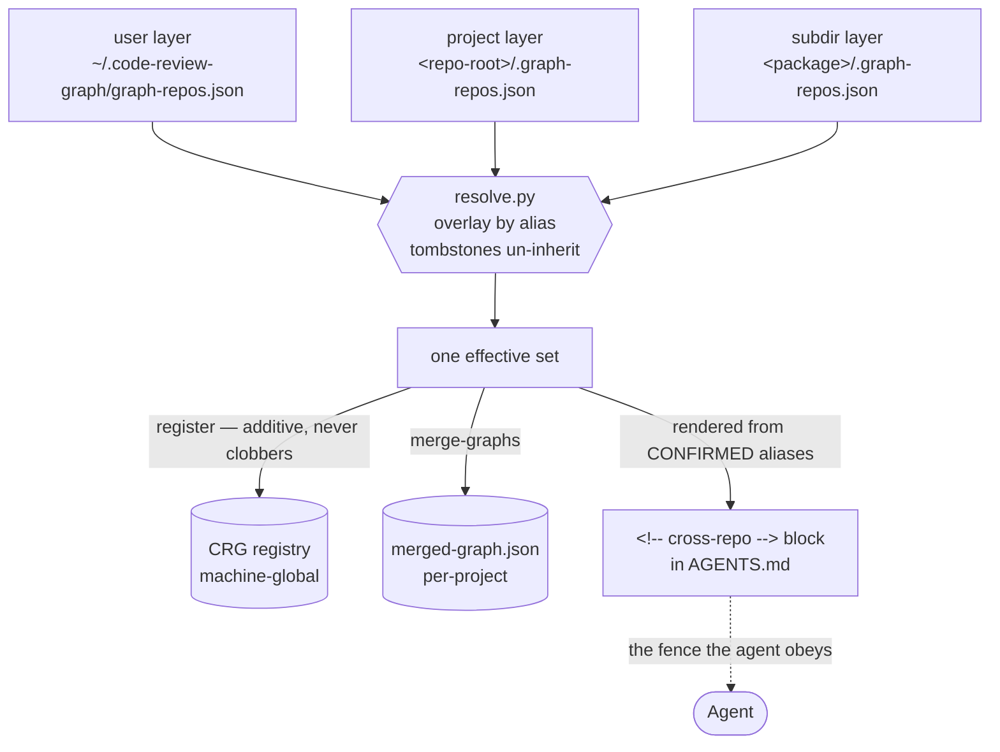

# register-cross-repo-graph

> **Status: experimental.** This skill writes a committed manifest (`.graph-repos.json`), adds
> entries to machine-local registry state, and edits `AGENTS.md`. Preview with `--dry-run` first.

Give one project **read-only** access to other projects' knowledge graphs, and — the part that
actually saves tokens — tell the agents in context which siblings are in scope, so they query the
graph instead of grepping across the folder boundary.

By design each repo owns and refreshes its **own** graph (see
[`setup-graph-hooks`](../setup-graph-hooks/SKILL.md)): code-review-graph (CRG) writes
`<repo>/.code-review-graph/graph.db`, graphify writes `<repo>/graphify-out/graph.json`. Nothing is
shared across folders until you declare it. This skill wires that link the read-only way: the
consumer only reads the foreign artifacts; each foreign repo stays single-writer via its own hooks.

## When to use

- A session in repo A needs a symbol, type, or call site that lives in repo B (frontend↔backend,
  shared library, monorepo sibling, a vendored service).
- You keep grepping/reading across into another checkout and want the graph to answer instead.
- You want a **committed, team-shared** list of which siblings this project may look at, so every
  future session — and every teammate — starts with the same scope.
- A monorepo package needs a _different_ sibling set from the repo root.

## Preconditions

1. The **consuming** repo has `AGENTS.md` at its root and its own graph wired — run
   [`setup-graph-hooks`](../setup-graph-hooks/SKILL.md) first.
2. At least one of `code-review-graph` / `graphify` is installed; plus `git`, `bash`, `python3`.
3. You can name each **foreign** repo by local path. (`graphify clone <github-url>` will clone a
   remote one and print its path.) Both repos must be checkouts on the **same machine**.

## How scope is declared: the manifest cascade

Scope lives in `.graph-repos.json` files that load hierarchically, **exactly like `AGENTS.md` /
`CLAUDE.md`** — lowest precedence first, nearest wins:

| Layer   | File                                    | Committed | Use for                                     |
| ------- | --------------------------------------- | --------- | ------------------------------------------- |
| user    | `~/.code-review-graph/graph-repos.json` | no        | personal siblings, visible to every project |
| project | `<repo-root>/.graph-repos.json`         | **yes**   | the team-shared sibling list — the default  |
| subdir  | `<subdir>/.graph-repos.json`            | **yes**   | a monorepo package with its own scope       |

```json
{
  "version": 1,
  "repos": [
    { "alias": "acme-api", "path": "../acme-api", "tools": ["crg", "graphify"], "notes": "auth + billing handlers" },
    { "alias": "acme-design-system", "path": "~/Work/acme-ds", "tools": ["crg"] },
    { "alias": "acme-legacy-ui", "remove": true }
  ]
}
```

- **`alias`** — `^[a-z0-9][a-z0-9._-]*$`. It is both the merge key across layers _and_ the token an
  agent uses to accept or reject a search hit. Namespace it (`acme-api`, not `api`): the CRG
  registry is shared with your other projects, and a bare `api` will collide.
- **`path`** — a relative path resolves **against the manifest that declared it**, not the CWD.
  That is what lets a committed `"../acme-api"` mean the same sibling checkout on every teammate's
  machine. `~` and `$VARS` expand.
- **`tools`** — `crg`, `graphify`, or both (default). Intersected with what is installed.
- **`notes`** — one line, rendered into the AGENTS.md table, so it doubles as routing help
  ("which repo do I ask for X").
- **`remove: true`** — a **tombstone**: the only way a nearer layer can un-inherit an entry from a
  lower one (a package dropping a repo its root declares).

Collisions are resolved and reported, never silent: across layers the nearer layer replaces the
whole entry; within one file the last wins with a warning.



Three writes, three different scopes — that asymmetry is the whole design. The registry is global
and only grows; the merged graph is yours alone; and the block is rendered from the aliases sync
**confirmed** afterwards, never from what it intended, so it cannot advertise a repo that will not
answer.

## Two registries, one scope

The thing to understand before trusting this skill:

- **CRG's registry is machine-global and shared with all your other projects.** Its path is
  hardcoded (`~/.code-review-graph/registry.json`) — it cannot be scoped per repo. So sync only
  ever **adds** to it and never unregisters an entry it did not create. `cross_repo_search_tool`
  therefore **will** return hits from repos belonging to your other projects.
- **Scope is enforced in context, not in the registry.** The `<!-- cross-repo -->` block in
  `AGENTS.md` lists the in-scope aliases and tells the agent to ignore everything else. That list is
  the enforcement surface. This is why the block matters as much as the registration.
- **graphify sidesteps the problem.** It gets a **per-project** merged graph at
  `<repo>/graphify-out/merged-graph.json` — genuinely isolated, no shared global state.

## Procedure

`$SKILL` is this skill's directory; `$SCOPE` is where the session is working (the repo root, or a
package inside a monorepo).

### 1. Choose the layer and author the manifest

Ask which layer the repos belong in — **project is the default** (committed, so teammates inherit
the same scope). Copy the starter if no manifest exists, then write the entries:

```bash
cp "$SKILL/assets/graph-repos.example.json" "$(git rev-parse --show-toplevel)/.graph-repos.json"
```

Prefer a path relative to the manifest in a committed layer; an absolute path is machine-specific
and the verifier warns about it.

### 2. Preview

```bash
bash "$SKILL/scripts/sync-cross-repo-graph.sh" "$SCOPE" --dry-run
```

Show the user the effective set, which layer each alias won from, and any repo whose graph is
missing. Nothing is written.

### 3. Offer builds — never force them

A foreign repo with no graph is reported `PENDING` and is **not** registered and **not** listed in
`AGENTS.md` (CRG silently skips a registered repo whose `graph.db` is absent, so listing it would
advertise an alias that can never answer). Building writes into **someone else's checkout**, so ask
before doing it, then:

```bash
bash "$SKILL/scripts/sync-cross-repo-graph.sh" "$SCOPE" --build missing
```

### 4. Sync

```bash
bash "$SKILL/scripts/sync-cross-repo-graph.sh" "$SCOPE"
```

Registers each in-scope repo with CRG (additively), rebuilds the per-project graphify merged graph,
and rewrites the `<!-- cross-repo -->` block in `AGENTS.md` from what it **confirmed** afterwards —
never from what it intended — so the block can never advertise a repo that will not answer. It is
idempotent: a second run changes nothing and leaves `git status` clean.

### 5. Verify

```bash
bash "$SKILL/scripts/verify-cross-repo-graph.sh" "$SCOPE"
```

Healthy is **0 failed**. It fails on block drift — someone edited a manifest and never re-synced.

### 6. Report

Name the in-scope aliases and the layer each came from, whether to commit the manifest (project and
subdir layers: yes; the user layer is not in the repo), and the removal path.

## Querying it

```bash
# CRG — spans repos. Keep only hits whose alias is in scope.
cross_repo_search_tool(query="…")    # MCP;  list_repos_tool() shows the full (superset) registry

# graphify — the per-project merged graph
graphify query "<term>"    --graph graphify-out/merged-graph.json
graphify path  "<A>" "<B>" --graph graphify-out/merged-graph.json
```

## Scenario: a cross-repo lookup, end to end

A frontend repo `acme-web` needs backend symbols from a sibling checkout `acme-api`. Both are
cloned side by side; `acme-web` already ran `setup-graph-hooks`. On this machine an unrelated
project once registered a repo called `pet-shop` — that matters at the end.

**1. Declare the scope.** `acme-web/.graph-repos.json`, committed, so every teammate inherits it:

```json
{
  "version": 1,
  "repos": [{ "alias": "acme-api", "path": "../acme-api", "notes": "auth + billing handlers" }]
}
```

**2. Sync.** `../acme-api` resolves against the manifest's own directory, not the CWD — which is
why the committed relative path means the same checkout on every machine:

```bash
bash "$SKILL/scripts/sync-cross-repo-graph.sh" . --dry-run # preview: shows the effective set
bash "$SKILL/scripts/sync-cross-repo-graph.sh" .           # register + merge + rewrite the block
```

**3. What lands in `AGENTS.md`.** The `<!-- cross-repo -->` block now names the one alias sync
confirmed, and tells every future session in this repo which hits to keep:

```markdown
**In-scope aliases: `acme-api`.**
```

**4. The lookup.** A session asks "where does the invoice total get computed?". Instead of
`cd ../acme-api` and grepping a repo it has never read, the agent queries:

```bash
cross_repo_search_tool(query="invoiceTotal")
```

**5. The part that surprises people.** The result comes back with **two** hits — one in `acme-api`,
one in `pet-shop`. CRG's registry is machine-global and has no per-project view, so the tool cannot
narrow the search; it returns the union of everything registered on the machine. The agent keeps the
`acme-api` hit and discards `pet-shop`, because the block says `acme-api` is the only alias in scope.

That is the fence: enforced **in context, not in the registry**. It is the right shape for read-only
lookup and it is not a security control — see the caveats below.

## Removing a repo

Tombstone it (or delete the entry) in the nearest layer, then re-sync — the alias leaves the
effective set and the `AGENTS.md` block, which is what actually narrows the agent. It stays in
CRG's global registry until you also pass `--prune`, which unregisters **only** aliases this repo
registered (tracked in `.code-review-graph/cross-repo-state.json`) and never touches another
project's.

## Caveats

- **The registry is a union; the block is the fence.** `cross_repo_search_tool` returns hits from
  every repo any project registered on this machine. Nothing stops an agent from reading a path
  outside the in-scope table except the instruction in the block. That is a soft boundary — fine for
  read-only lookup, not a security control.
- **A committed manifest is a scope grant.** A PR that adds an entry adds a repo path to every
  teammate's agent scope. Read-only and local-path-only, but review it like any other config.
- **Freshness is yours to keep.** Registering neither builds nor refreshes. You read whatever state
  the foreign `graph.db` / `graph.json` is in; the verifier warns when a sibling's HEAD is newer
  than its graph. Each sibling refreshes itself via its own hooks — or add it to CRG's watch daemon
  (`code-review-graph daemon add <path>`, a _different_ global file, `watch.toml`).
- **The merged graph is refreshed by nothing.** `graphify-out/graph.json` has a post-commit hook;
  `merged-graph.json` does not, so it goes stale on this repo's next commit. The verifier warns;
  `--merge-only` rebuilds it (AST-only, no LLM cost).
- **Read-only covers search/lookup only.** `cross_repo_search_tool` spans repos; blast-radius tools
  (`get_impact_radius`, `get_affected_flows`) stay single-repo. Tracing a change _into_ another repo
  needs one merged graph, not two read separately.
- **Read-mostly, not zero-write.** CRG opens the foreign `graph.db` in SQLite WAL mode, which may
  create `-wal`/`-shm` side files next to it — dirtying that repo's `git status` if it does not
  gitignore `.code-review-graph/`. The verifier warns. A read-only or network-mounted sibling is
  worse: SQLite cannot open WAL and `cross_repo_search` silently returns nothing.
- **Concurrency.** Sync takes a lock around the CRG phase because `register` read-modify-writes one
  global file. Two syncs at once are safe; the second waits, then warns and skips.
- **Monorepos.** The block is written to the nearest `AGENTS.md` at or above the scope dir, never
  above the repo root. If a package contributes subdir-layer entries but has no `AGENTS.md` of its
  own, sync **refuses** rather than leak package scope repo-wide.

## Notes

- **Three files now live in `~/.code-review-graph/`. Do not confuse them.** `registry.json` (CRG's
  query set, written only via `register`/`unregister`) · `watch.toml` (CRG's auto-refresh set,
  written by `daemon add`/`remove`) · `graph-repos.json` (**ours** — the user layer of the manifest
  cascade). Sync never writes CRG's two; the verifier fails loudly if `registry.json` ever grows a
  manifest's shape.
- **CRG and graphify are independent systems.** Building one does not satisfy the other. Use
  whichever the consuming repo already relies on — or both.
- Bundled files: `scripts/sync-cross-repo-graph.sh`, `scripts/verify-cross-repo-graph.sh`,
  `scripts/manifest/{resolve,render}.py` (the shared resolver both scripts call, so the installer
  and the verifier can never disagree), `assets/agents-cross-repo.md`, `assets/graph-repos.example.json`.
- Pairs with [`repair-graph-hooks`](../repair-graph-hooks/SKILL.md) if a sibling's graph goes stale
  or its tool install breaks.
