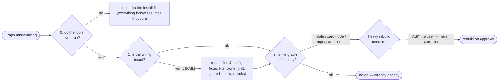

# repair-graph-hooks

> **Status: stable.** This skill runs real repairs (re-invokes the installer, re-syncs
> ignore files, clears stale locks) — review what it reports before approving a heavy rebuild.

Re-check → validate → repair the knowledge-graph layer that [`setup-graph-hooks`](../setup-graph-hooks/SKILL.md)
installed. It is the recovery counterpart to that skill's read-only `verify-graph-hooks.sh`: the
verifier only _reports_ health, and re-running the installer only fixes a subset. This skill adds
**early tool-integrity detection** plus the **graph-state** checks neither script performs, then
applies safe file/wiring repairs automatically and _offers_ (never auto-runs) the heavy graph
rebuild.

Everything is idempotent: on a healthy repo it is a clean no-op. It never deletes source, never
force-pushes, and clears only empty lock directories (`rmdir`, never `rm -rf`).

## When to use

- The graph tools "aren't working" — empty/stale results, MCP tools erroring, or a hook that never
  fires. Note that `semantic_search` returning keyword-quality hits is **not** a fault on a repo
  that never opted into embeddings; it is the designed fallback.
- `verify-graph-hooks.sh` reported a `[FAIL]` or a `[warn]` you want resolved.
- After changing which AI tools the repo uses (a tool dropped from a later install can leave a
  stale end-of-turn refresh owner → duplicate graph builds).
- A checkout on a new machine / after a Windows clone (exec bit or CRLF may have broken a hook).
- `code-review-graph` or `graphify` was reinstalled, upgraded, or moved and may be broken.

Do **not** use this to do first-time setup — if `.graph-hooks/` is absent entirely, run
[`setup-graph-hooks`](../setup-graph-hooks/SKILL.md) instead.



Step 0 comes first and fails fast on purpose: every check below it assumes the tools actually
execute, so a broken `code-review-graph` install would otherwise surface as a dozen confusing
downstream failures. The last gate is the house rule — a rebuild can be expensive, so this skill
_offers_ it and never runs it unasked.

## Preconditions

1. **`AGENTS.md` exists at the repo root** and **`.graph-hooks/` exists.** If either is missing,
   this repo was never wired — stop and point the user at `setup-graph-hooks`. Do not repair a
   repo that was never set up.
2. The repo is a git working tree.

## Prerequisites & platform support

Same runtime as `setup-graph-hooks`: `bash`, `python3` (stdlib only), `git`, and `sqlite3` for the
graph-state probes. macOS and Linux are first-class; Windows via WSL only. The two graph tools
(`code-review-graph`, `graphify`) are optional — the repair still fixes wiring when they are
absent; it just reports the graph itself as dormant.

This skill reuses the sibling skill's scripts. `$GRAPH_SKILL` below is the installed
`setup-graph-hooks` skill directory (its `scripts/verify-graph-hooks.sh` and
`scripts/setup-graph-hooks.sh`); `$REPO` is the target repo root
(`git rev-parse --show-toplevel`).

## Procedure

### 0. Tool-integrity smoke check (run FIRST — fail fast)

`verify-graph-hooks.sh` only does `command -v` — it confirms a binary is on `PATH`, not that it
_runs_. A present-but-broken toolchain (wrong Python, broken pipx venv, PATH shadowing, outdated
version, unregistered MCP server) makes every downstream repair pointless. Probe each tool
read-only and classify it `OK / broken / outdated / absent`:

```bash
# code-review-graph: does it actually execute, and can it read this repo's graph?
code-review-graph --version # exits 0? catch tracebacks / wrong-Python
code-review-graph status    # lightweight functional ping on $REPO

# graphify: does the command resolve and run?
graphify --version
```

- **broken** (on PATH but non-zero exit / traceback): stop and surface the exact remedy —
  `pipx reinstall code-review-graph` / `pipx reinstall graphifyy` — before touching wiring.
- **outdated**: note the installed vs expected version; offer `pipx upgrade`.
- **absent**: fine — the hooks are dormant by design; continue with wiring repair and tell the user
  the install commands (`pipx install code-review-graph`, `pipx install graphifyy` — note the
  double `y`: the package is `graphifyy`, the command is `graphify`).
- **MCP not registered** (CRG present but its MCP tools missing): `code-review-graph install`
  re-registers the server with the detected AI platforms.

### 1. Detect wiring (reuse the verifier)

```bash
bash "$GRAPH_SKILL/scripts/verify-graph-hooks.sh" "$REPO"
```

Capture every `[FAIL]` / `[warn]`. This already covers structure, per-tool JSON validity, that the
dispatcher fires, and the single-refresh-owner invariant.

### 2. Extend detection — the graph-state checks the verifier lacks

Read-only probes, each reported as a finding:

- **Graph staleness.** Compare `.code-review-graph/graph.db` mtime and its embedded build commit
  against `git rev-parse HEAD`; flag if the graph lags HEAD.
- **DB integrity / zero-node.** `sqlite3 .code-review-graph/graph.db 'PRAGMA integrity_check;'`
  plus a node-count probe (the same `SELECT` used in `.graph-hooks/core/session-context.sh`); flag
  a corrupt DB or a 0-node graph (both read as "no graph" at runtime and hide silently).
- **Embeddings — three states, only two are defects.** Semantic search is an opt-in tier: with an
  empty `embeddings` table CRG's `semantic_search` falls back to keyword search over node names,
  which is a supported configuration. Compare `SELECT count(*) FROM embeddings` against
  `SELECT count(*) FROM nodes WHERE kind!='File'` (both live in `graph.db`):
  - **zero** — keyword mode. Report it, do not offer a fix. Point at
    `setup-graph-hooks/scripts/setup-embeddings.sh` only if the user asks for semantic search.
  - **partial** (`0 < embeddings < nodes`) — an `embed` was interrupted. Flag and offer re-embed.
  - **unrefreshable** — vectors exist, but `.graph-hooks/core/embed-provider.sh` prints nothing,
    so the hooks skip `embed` and the vectors are drifting. Usually `.code-review-graph/embed.env`
    was deleted while the graph carries `openai:`/`google:`/`minimax:` vectors, which cannot be
    reconstructed without their env vars. Flag; the fix is to restore `embed.env` (re-run
    `setup-embeddings.sh`) or re-embed with the `local` provider.
- **Ollama-backed embeddings, daemon down.** When `embed.env` points `CRG_OPENAI_BASE_URL` at a
  localhost endpoint that does not answer `/api/tags`, embeddings will never refresh. Flag it —
  the graph itself is fine, so nothing else surfaces this.
- **Ignore-file drift.** Diff `.code-review-graphignore` / `.graphifyignore` against the shipped
  template `$GRAPH_SKILL/scripts/graphignore`; flag deleted, truncated, or hand-edited files (a
  broken ignore file makes the graph index `node_modules`/`dist`/`.env*`).
- **Exec-bit / CRLF.** Check the exec bit on `.graph-hooks/copilot/*.sh` and the installed
  `.git/hooks/post-commit` (the verifier checks only the cores); grep the shipped `.sh` for `\r`
  (a CRLF shebang silently never fires).
- **`.gitignore` leak.** Confirm `.claude/settings.local.json` is ignored (the verifier misses it).
- **Stale refresh lock.** Detect a wedged `$TMPDIR/crg-graph-*.lock` directory or a dead-PID
  `crg-graph-*.pid` blocking the refresh.
- **settings.local vs settings.example divergence** for Claude — the verifier prefers `.local` and
  never compares the two.

### 3. Repair — safe and automatic (file / wiring level)

1. **Reconstruct the full historical `--tools` set.** Scan which tool config files actually exist —
   `.claude/`, `.gemini/settings.json`, `.github/hooks/graph.json`, `.agents/` — not just the
   tools currently detected. A tool wired in a past run but omitted now keeps a stale end-of-turn
   owner; only passing the full set prunes it.
2. **Back up + JSON-validate each tool config before reinstalling.** The installer runs under
   `set -e` and its JSON merge aborts on invalid input — an unguarded re-run could half-apply.
   Copy each config aside and `python3 -m json.tool` it first; if one is corrupt, restore from the
   backup or hand-fix before proceeding.
3. **Re-run the installer** to restore missing files, exec bits on the cores, `.gitignore`
   entries, and collapse any refresh-owner drift to exactly one:
   ```bash
   bash "$GRAPH_SKILL/scripts/setup-graph-hooks.sh" "$REPO" \
     --tools <historical-set> --primary <resolved-primary>
   ```
4. **Re-sync ignore files** from the template, and **clear stale locks** (`rmdir` the empty lock
   dir; kill nothing, delete nothing else).

### 4. Repair — graph state: DETECT + OFFER (never auto-run heavy builds)

Per the house rule, do not silently launch a long build. Report the state findings and offer the
one-time fix for the user to approve:

```bash
code-review-graph update # stale graph
code-review-graph build  # corrupt or zero-node (full rebuild)
```

Only offer an embed when the repo has already opted in — a partial or unrefreshable embeddings
table. Pass the provider the graph was embedded with; the bare command defaults to `local` and
errors out on a repo that uses Ollama or a hosted endpoint:

```bash
code-review-graph embed --provider "$(bash .graph-hooks/core/embed-provider.sh)"
```

A full `build` does **not** clear the embeddings table — rows are keyed by `qualified_name` and
survive a re-parse. It does leave newly-parsed or renamed nodes unembedded, which reads as the
**partial** state above, so on an opted-in repo follow a rebuild with the embed command.

### 5. Re-verify

```bash
bash "$GRAPH_SKILL/scripts/verify-graph-hooks.sh" "$REPO"
```

Healthy result is **0 failed**. If a `[FAIL]` persists, surface it and stop.

### 6. Report

Summarize: each tool's integrity verdict, what was auto-repaired, any rebuild the user still needs
to approve, and the final verifier summary line. Keep it short.

## Verification

Running this skill against a healthy repo is a **no-op**: step 0 reports every tool `OK`, the
verifier passes with 0 failed, and steps 2–4 find nothing to change. To exercise it, break one
thing in a throwaway checkout (e.g. `chmod -x` a `.graph-hooks/copilot/*.sh`, or drop a
`.gitignore` entry), run the procedure, and confirm the verifier goes `[FAIL] → 0 failed`.

## Notes

- **Detector reuse, not duplication.** The wiring detector is `setup-graph-hooks`'
  `verify-graph-hooks.sh` and the file/wiring repair is that skill's own idempotent installer —
  this skill orchestrates them and adds only the tool-integrity and graph-state layers on top.
- **Why tool-integrity runs first.** Repairing wiring or rebuilding a graph against a broken CRG
  binary wastes effort and hides the real fault; a fast `--version` + `status` ping catches it in
  seconds.
- **Ordering with husky.** If `setup-project-tooling` (husky) was run after graph setup, the git
  hook path moved to `.husky/`; re-running the installer here re-points the `post-commit` refresh
  correctly. See [`setup-project-tooling`](../setup-project-tooling/SKILL.md).
