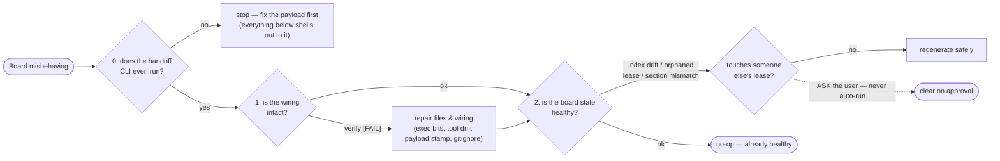

# repair-handoff

> **Status — experimental.** This skill runs real repairs (re-invokes the installer, regenerates
> the index, clears orphaned lock directories). Review what it reports before approving anything
> that touches a lease someone else may hold.

Re-check → validate → repair the handoff layer that [`setup-handoff`](../setup-handoff/SKILL.md)
installed. It is the recovery counterpart to that skill's read-only `verify-setup-handoff.sh`: the
verifier only _reports_ wiring health, and re-running the installer only refreshes files. Neither
touches **board state** — leases, the generated index, the archive — which is precisely the state
that breaks.

Everything is idempotent: on a healthy board it is a clean no-op. It never deletes a handoff doc
or its content, never edits a doc whose lease it does not hold, and clears only empty lock
directories (`rmdir`, never `rm -rf`).

## When to use

- A lease cannot be claimed or released — `claim` reports a holder that no longer exists, or the
  edit gate blocks the session that rightfully holds the lease.
- `INDEX.md` is missing, stale, or was hand-edited. It is generated; drift here is a repair, not
  an edit.
- A handoff doc exists but never appears on the session board, or appears in the wrong section.
- A handoff you delegated has not come back and you cannot tell whether it is stuck — see
  [`delegate-handoff`](../delegate-handoff/SKILL.md) for the export/import loop this recovers from.
- The session-start hook reported `Board needs attention`.
- `verify-setup-handoff.sh` reported a `[FAIL]`, or a `[warn]` you want resolved.
- After changing which AI tools the repo uses — a tool dropped from a later install can leave a
  stale enforcement hook, so the gate fires from a tool nobody runs.
- A shared cross-repo board whose section stopped resolving after `.handoff-repos.json` changed.
- A checkout on a new machine, or after a Windows clone (the exec bit or CRLF may have broken the
  CLI or its hooks).

Do **not** use this for first-time setup. If `.agents/handoff/` is absent entirely, run
[`setup-handoff`](../setup-handoff/SKILL.md) instead.



Step 0 comes first and fails fast on purpose: every check below shells out to the installed
`handoff` CLI, so a payload that does not execute would otherwise surface as a dozen confusing
downstream failures. The last gate is the house rule — a lease may belong to live work in another
session, so this skill _offers_ to clear it and never does so unasked.

## Preconditions

1. **`.agents/handoff/` exists** (or the board this repo points at does). If not, the repo was
   never wired — stop and point the user at `setup-handoff`. Do not repair a board that was never
   set up.
2. The repo is a git working tree.

## Prerequisites and platform support

Same runtime as `setup-handoff` — `bash`, `git`, and `python3` for the enforcement gate's payload
parsing. macOS and Linux are first-class; Windows via WSL only.

This skill reuses the sibling skill's scripts. `$HANDOFF_SKILL` below is the installed
`setup-handoff` skill directory (its `scripts/verify-setup-handoff.sh`,
`scripts/setup-handoff.sh`, and `scripts/detect-handoff.sh`); `$REPO` is the target repo root
(`git rev-parse --show-toplevel`); `$BOARD` is the resolved board directory, which is **not**
always `$REPO/.agents/handoff` — a cross-repo install points elsewhere.

On a sectioned shared board every command must carry `HANDOFF_GROUP`. A command typed by hand
inherits nothing from the hooks, so export it once before you start, or `list` shows other repos'
work and `claim` cannot resolve an id in your section.

## Procedure

### 0. Payload smoke check (run FIRST — fail fast)

`verify-setup-handoff.sh` checks that the CLI is present and executable. That is not the same as
it _running_ — a CRLF shebang, a truncated copy, or a missing `python3` all leave an executable
file that dies on invocation.

```bash
"$BOARD/handoff" list    # exits 0? or shebang / syntax / parse error
bash -n "$BOARD/handoff" # syntax check without executing
bash -n "$BOARD/scripts/hooks.sh"
```

Classify and act:

- **broken** (non-zero exit, `bad interpreter`, or a syntax error) — the payload is corrupt.
  Re-run the installer to restore it before touching anything else, then re-run this step.
- **CRLF** — `grep -c $'\r' "$BOARD/handoff"` returns non-zero on a Windows-mangled copy. The
  installer rewrites it; a `.gitattributes` with `* text=auto eol=lf` stops it recurring.
- **not executable** — `chmod +x` on the CLI and `scripts/hooks.sh`.
- **`python3` absent** — the deny gate cannot parse hook payloads, so enforcement silently
  degrades to advisory. Report it; it is an environment fix, not a board fix.

### 1. Detect wiring (reuse the verifier)

```bash
bash "$HANDOFF_SKILL/scripts/verify-setup-handoff.sh" "$REPO"
```

Capture every `[FAIL]` and `[warn]`. This already covers payload presence and exec bits, the
config, the `.gitignore` entry for `.locks/`, the `AGENTS.md` block, which tools are wired, the
hard-enforcement primary, and — since payload versioning landed — whether the installed board is
older than what the skill now ships.

A `payload vN installed, skill ships vM` warning is the one finding whose fix is exactly
"re-run the installer", so resolve it in step 3 rather than treating it as board state.

### 2. Extend detection — the board-state checks the verifier lacks

Read-only probes, each reported as a finding. None of these are things a wiring verifier can see,
because each depends on the relationship between the board's parts rather than on any one file.

- **Index drift.** `INDEX.md` is generated by `handoff index`. Regenerate into a temp location and
  diff against the committed file; any difference means it was hand-edited or left stale. Also
  flag `INDEX.md` missing while docs exist.
- **Orphaned leases.** A lock directory under `$BOARD/.locks/` whose handoff doc no longer exists
  in the section or its `archive/` — left behind by a rename or a delete. Note the asymmetry with
  expired leases, which need no repair at all: `hooks.sh sessionstart` runs `reap_expired` and
  clears any lease whose `owner` lacks a future `expires=`, including a lock directory with no
  `owner` file. Only a lease that is still **valid** can be orphaned in a way worth reporting.
- **Doc frontmatter.** Every doc needs parseable frontmatter with `id`, `status`, and `severity`.
  A doc the CLI cannot parse silently drops off the session board. Flag a `:` inside any value —
  it breaks the frontmatter render, and the CLI folds colons to an em dash precisely to avoid it.
- **Id and filename disagreement.** The lock key is the file stem, so a doc whose `id:` does not
  match its filename can be claimed under one name and gated under another.
- **Open versus archive.** A doc with `status: done` still on the open board, or an archived doc
  still holding a lease.
- **Section resolution (shared boards only).** Confirm the board pointer in the tool hook commands
  resolves, that the board's effective `groups` and `groupLayout` match what `.handoff-repos.json`
  declares, that this repo's own `.agents/handoff.config.json` names the right `group`, and that its
  section directory or prefix exists. A mismatch is why handoffs "disappear" — they are filed into a
  section nobody reads. **Read those through the resolver, not by grepping a file**: board facts live
  in `$BOARD/config.json` on any board the current installer wrote and in the legacy KEY=value
  `$BOARD/config` only on older ones, and the repo's section is in its own
  `.agents/handoff.config.json` — not baked into the hook command. `$BOARD/scripts/config.sh`'s
  `handoff_config_load <board> [<repo>]` already decides all of that.

  ```bash
  . "$BOARD/scripts/config.sh" && eval "$(handoff_config_load "$BOARD" "$REPO")"
  echo "$HC_GROUPS / $HC_GROUP_LAYOUT / $HC_GROUP"
  ```

- **Brief repo identity (shared boards only).** `$BOARD/repos.json` is what `handoff export`
  resolves a handoff's `audience` to a real repo through. It is generated from
  `.handoff-repos.json`, so a missing or drifted one is not visible at export time — every
  cross-repo brief just quietly renders `repo_root_commit: unverified`. Detect it with
  `verify-cross-repo-handoff.sh`; the repair is a re-sync (step 5 below), never a hand-edit.
- **AGENTS.md block drift.** The routing block between `<!-- handoff:begin` and
  `<!-- handoff:end -->` is generated from the skill's `assets/agents-handoff.md`, so it drifts the
  same way the payload does — and a block that merely _exists_ still reads as installed while
  advertising commands the CLI no longer documents. Presence is not the check; content is:

  ```bash
  python3 "$HANDOFF_SKILL/scripts/splice-agents-block.py" --check \
    --file "$REPO/AGENTS.md" \
    --template "$HANDOFF_SKILL/assets/agents-handoff.md" \
    --handoff-dir "$HDREL" # 0 current  2 drifted  3 missing  1 malformed
  ```

  `verify-setup-handoff.sh` runs exactly this, so a `[warn]` there is the finding; the standalone
  form is for a board whose verifier predates the check. The repair is step 3's installer re-run,
  which rewrites the block — never a hand-edit, which just re-drifts on the next asset change.
  Malformed markers (duplicated or unbalanced) are the one case the installer refuses rather than
  clobbers: fix those by hand first, then re-run.

- **Enforcement owner drift.** Scan which tool config files actually exist, not just the tools
  currently detected. A tool wired in a past run still carries the pretool gate.
- **Hook command drift.** The wired hook commands go stale the same way, and for a subtler
  reason: the installer rewrites them on every run, so they only drift when nobody re-runs it —
  and the payload stamp cannot see that, because it covers the payload **files**, not the wiring
  written around them. A board can read `payload vN matches` while its hooks still run a command
  shape the skill stopped writing. Compare content per wired tool:

  ```bash
  HANDOFF_HDPATH="$HDREL" HANDOFF_TOOL=claude HANDOFF_PRIMARY=0 \
    python3 "$HANDOFF_SKILL/scripts/merge-hooks.py" TOOL_CONFIG --check
  # 0 current  2 drifted  3 not wired
  ```

  Pass `HANDOFF_PRIMARY=1` for the tool that owns the pretool deny gate, or an advisory tool is
  reported as missing hard-enforcement hooks it should not have. `verify-setup-handoff.sh` runs
  this per wired tool, so a `[warn]` there is the finding. The repair is step 3's installer re-run.

- **Orphaned delegation.** A doc with `delegated_at` older than the lease TTL, no `result_at`, and
  either a missing `brief` file or no lease — a handoff that went out via
  [`delegate-handoff`](../delegate-handoff/SKILL.md)'s `handoff export` and never came back. It is
  claimed on the board but nobody is actually holding it, so it silently blocks anyone else from
  claiming that id. The repair is to contact the executor to find out where it stands, or release
  the lease and re-file the work.

### 3. Repair — safe and automatic (file, wiring, and index)

1. **Reconstruct the full historical `--tools` set.** Scan for every tool config that exists —
   `.claude/`, `.gemini/settings.json`, `.github/hooks/handoff.json`, `.agents/` — not just the
   tools detected now. Only passing the full set prunes a stale enforcement hook.
2. **Back up and JSON-validate each tool config before reinstalling.** The installer's merge
   aborts on invalid input, which would half-apply the repair. Copy each config aside and
   `python3 -m json.tool` it first.
3. **Re-run the installer** to restore missing payload files, exec bits, the `.gitignore` entry,
   the `AGENTS.md` block, and the payload stamp:
   ```bash
   bash "$HANDOFF_SKILL/scripts/setup-handoff.sh" "$REPO" --tools HISTORICAL_SET --primary PRIMARY
   ```
   Pass `--handoff-dir` as well when the board is not at the default location, or the installer
   will scaffold a second board beside the real one.
4. **Regenerate the index.** Safe to run unconditionally — it is generated output, and nobody's
   work is encoded in it:
   ```bash
   "$BOARD/handoff" index
   ```
5. **Re-run the cross-repo sync** when the board is shared and step 2 found a section mismatch or
   `repos.json` drift, so the wiring, the sub-indexes, the `AGENTS.md` block, and the brief-identity
   registry agree again. See
   [`register-cross-repo-handoff`](../register-cross-repo-handoff/SKILL.md). Re-export any brief
   that went out carrying `repo_root_commit: unverified` while the registry was stale — the fixed
   registry does not repair a brief already in an executor's hands.

### 4. Repair — leases — DETECT and OFFER (never auto-clear)

A lease is a claim on live work in another session. Clearing one that is genuinely held lets two
agents edit the same doc, which is the exact failure the board exists to prevent. So report the
finding and let the user decide.

Expired leases need no decision — they self-heal, and the CLI clears them explicitly:

```bash
"$BOARD/handoff" reap         # show expired leases
"$BOARD/handoff" reap --force # clear them
```

An **orphaned but still-valid** lease is the case `reap` will not touch, because it filters on
expiry. Its doc is gone, so there is nothing left to release against. Offer to clear it, naming
the holder, and only on approval remove the lease file and the now-empty directory
(`rmdir` — never `rm -rf`, and never the doc).

If the holder may still be live, the honest answer is to leave it and tell the user who holds it.
A lease outlives at most `HANDOFF_TTL_HOURS` (default 4) anyway.

### 5. Re-verify

```bash
bash "$HANDOFF_SKILL/scripts/verify-setup-handoff.sh" "$REPO"
"$BOARD/handoff" list
```

Healthy result is **0 failed** and a `list` that shows the expected handoffs in the expected
section. If a `[FAIL]` persists, surface it and stop.

### 6. Report

Summarize — the payload verdict from step 0, what was auto-repaired, any lease still awaiting the
user's decision, and the final verifier summary line. Keep it short.

## Verification

Running this skill against a healthy board is a **no-op**: step 0 reports the CLI `OK`, the
verifier passes with 0 failed, and steps 2–4 find nothing to change. To exercise it, break one
thing in a throwaway checkout — `chmod -x` the CLI, delete `INDEX.md`, or create a lock directory
for a doc that does not exist — run the procedure, and confirm the verifier goes `[FAIL] → 0
failed` and `handoff list` recovers.

## Notes

- **Detector reuse, not duplication.** The wiring detector is `setup-handoff`'s
  `verify-setup-handoff.sh` and the file repair is that skill's own idempotent installer. This
  skill orchestrates them and adds only the payload-integrity and board-state layers on top.
- **Why board state needs its own skill.** Re-running an installer refreshes files. It cannot
  reconcile a lease with a doc that was renamed, regenerate an index someone hand-edited, or
  notice that a repo is filing handoffs into a section nobody reads. That is the whole reason this
  skill exists, and the test for whether any future setup skill needs a repair sibling — it does
  only when it manages state outside the files it wrote.
- **What deliberately is not here.** A stale-payload check does not belong in the session hook.
  The hook runs inside the target repo, where the skill directory is unreachable, so it can read
  the installed stamp but has nothing to compare it against. That comparison lives in
  `verify-setup-handoff.sh`, which runs from the skill directory and can reach both halves.
- **Ordering with the cross-repo sync.** If `register-cross-repo-handoff` ran after `setup-handoff`,
  the board moved out of this repo. Re-running the installer without `--handoff-dir` would scaffold
  a fresh empty board beside it — always resolve `$BOARD` from the wired hook command first.
