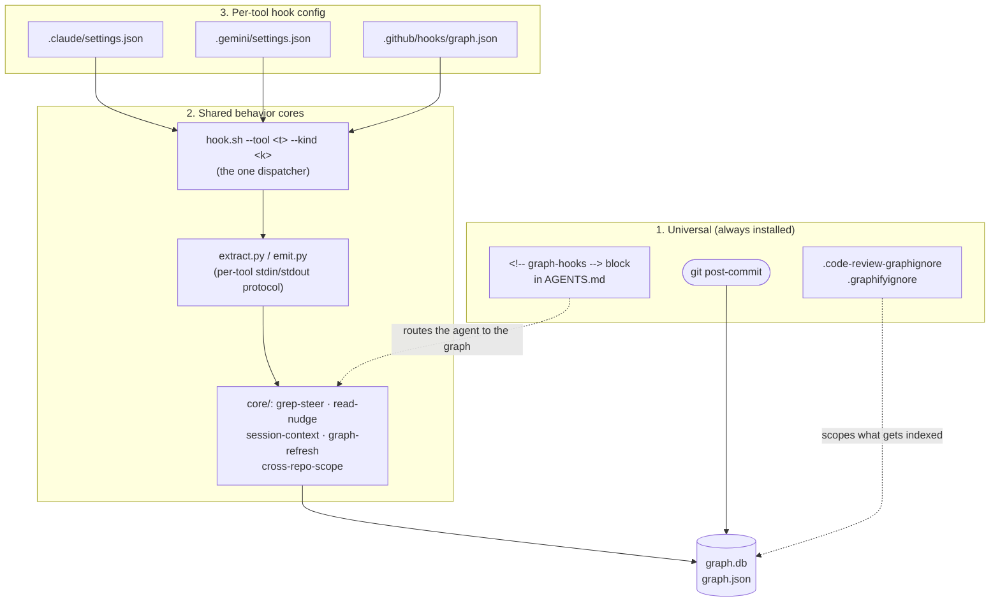

# setup-graph-hooks

Sets up the self-updating knowledge-graph layer for **every AI tool the repo uses**, and
registers the routing rules in `AGENTS.md` so each agent prefers graph queries over grep.
Runs as the second step of repo onboarding, right after `initial-project` has created the
canonical `AGENTS.md`.

Everything here is idempotent and degrades gracefully: every hook silently no-ops when a tool
or graph is absent, so it is safe on any repo, with or without the tools installed yet.

## Architecture: three layers

1. **Universal (tool-agnostic, always installed).** A git `post-commit` graph refresh, the
   `.code-review-graphignore` / `.graphifyignore` files, `.gitignore` entries, and the
   `<!-- graph-hooks -->` routing block appended to `AGENTS.md`. Because every tool's entry
   file `@AGENTS.md`-imports (set up by `initial-project`), the routing block reaches all
   tools with no per-tool edit.
2. **Shared behavior cores (one source of truth).** The behaviors live once, protocol-free,
   under `.graph-hooks/core/`: `grep-steer.sh` (steer grep/find to the graph), `read-nudge.sh`
   (prefer graph tools over reading source), `session-context.sh` (inject a query cheatsheet),
   `graph-refresh.sh` (the incremental `update`, repo-global-locked), and `cross-repo-scope.sh`
   (which sibling repos this repo may read — silent unless
   [`register-cross-repo-graph`](../register-cross-repo-graph/SKILL.md) has run, so the other three
   need no feature flag). A single `.graph-hooks/hook.sh --tool <t> --kind <k>` dispatcher runs
   them; `core/extract.py` and `core/emit.py` hold the entire per-tool stdin/stdout protocol table.
3. **Per-tool hook config.** For each chosen tool, `config/render.py` emits that tool's native
   hook config and the installer merges it in (replacing only the hooks subtree, never
   clobbering user keys). Only the **primary** tool gets the end-of-turn refresh.



The point of the middle layer is that a behavior is written **once**. Adding a fourth tool means a
new row in the protocol table and a new config renderer — never a fourth copy of `grep-steer`. Only
one tool is named `--primary`, so N wired tools still produce exactly one refresh per turn.

### Per-tool support

| Tool           | Config file                | Pre-tool event              | Session event  | End-of-turn  | Deny shape                   |
| -------------- | -------------------------- | --------------------------- | -------------- | ------------ | ---------------------------- |
| Claude Code    | `.claude/settings*.json`   | `PreToolUse` (matcher)      | `SessionStart` | `Stop`       | `permissionDecision:"block"` |
| Gemini CLI     | `.gemini/settings.json`    | `BeforeTool` (regex)        | `SessionStart` | `AfterAgent` | `decision:"deny"`            |
| GitHub Copilot | `.github/hooks/graph.json` | `preToolUse`                | `sessionStart` | `agentStop`  | `permissionDecision:"deny"`  |
| Antigravity    | `.agents/hooks.json`       | `PreToolUse` _(unverified)_ | —              | —            | _(unverified)_               |

Sources: [Claude Code hooks](https://code.claude.com/docs/en/hooks.md),
[Gemini CLI hooks reference](https://github.com/google-gemini/gemini-cli/blob/main/docs/hooks/reference.md),
[GitHub Copilot hooks reference](https://docs.github.com/en/copilot/reference/hooks-reference),
[Antigravity hooks](https://antigravity.google/docs/hooks).

**Antigravity is gated.** Its hook contract is not yet confirmable from public docs, so the
installer writes an inert `.agents/hooks.json.example` and never activates it. Antigravity still
gets the full universal layer (git refresh + AGENTS.md routing). To activate later, verify the
contract against a live install, then rename the example to `.agents/hooks.json`.

## Preconditions

1. **`AGENTS.md` exists at the repo root.** This skill chains after `initial-project`. If it is
   missing, stop and tell the user to run `initial-project` first — do not create it here.
2. The repo is a git working tree.

If either fails, report it and stop. Do not partially apply.

## Prerequisites & platform support

Beyond the two preconditions above (`AGENTS.md` at root, and a git working tree), the installer,
verifier, and hooks need:

- **Hard runtime:** `bash`, `python3` (stdlib only — `json`, `sqlite3`, `argparse`; 3.6+ for
  f-strings), and `git`. The graph read path uses `sqlite3` with FTS5 when available and falls
  back to `LIKE` otherwise. No `node` or `jq` (husky is only _detected_, never executed).
- **Optional graph tools — dormant until built, never required to install the hooks:**
  `pipx install code-review-graph` (MCP tools + graph search), and `pipx install graphifyy` (note
  the double `y`: the PyPI package is `graphifyy`, the installed command is `graphify`). Every hook
  `command -v`-checks its tool and silently no-ops when absent. Vector embeddings are a separate
  opt-in tier — see step 8; nothing here installs PyTorch.
- **Platform — macOS and Linux are first-class**, with the cross-platform differences already
  shimmed in the scripts: `md5sum || md5` for key hashing, a `mkdir`-based lock instead of `flock`
  (macOS ships no `flock`), `timeout || gtimeout ||` uncapped for the commit-time cap, and a
  `uname -s`-branched resource guard (`nproc`/`/proc` on Linux, `sysctl` on Darwin).
- **Windows is supported via WSL only** — everything is bash + POSIX sh + `python3` with no
  PowerShell/cmd path. Under WSL: keep the repo on the **Linux filesystem** (a `/mnt/c` mount can
  drop the hook exec bit — which the verifier reports as a _warning_, not a failure — and hurts
  build speed), and ensure the shipped `.sh`/`.py` files check out with **LF** endings so the
  `#!/usr/bin/env bash` shebangs are not broken by CRLF (the repo's `.gitattributes` enforces
  this). The `post-commit` hook's `disown` is a guarded no-op under dash `/bin/sh`.

## Procedure

`$SKILL_DIR` is this skill's folder; `$REPO` is the target repo root.

### 1. Resolve the repo root

```bash
REPO="$(git rev-parse --show-toplevel)"
```

### 2. Detect which tools the repo uses, and ask which to wire

Mirror `initial-project`. Detect by marker — Claude (`.claude/`, `CLAUDE.md`), Gemini
(`.gemini/`, `GEMINI.md`), Copilot (`.github/copilot-instructions.md`), Antigravity
(`ANTIGRAVITY.md`, `.antigravity/`, `.agents/`). Present all four with `AskUserQuestion`
(`multiSelect: true`), pre-selecting the detected ones. The universal layer installs regardless
of the choice.

### 3. Pick the primary refresh owner

If more than one tool is chosen, ask (`AskUserQuestion`, single-select) which **one** tool owns
the per-turn graph refresh — `code-review-graph update`. Pre-select the
most-used / first-detected tool, and include a _"None — refresh only on git commit"_ option.
Only that tool gets the end-of-turn hook; the rest get the cheap read-side hooks. This is what
keeps N wired tools from triggering N graph builds. (`graphify` is not part of this choice — it
runs single-owner from the git `post-commit` hook.)

### 4. Wire the files

```bash
bash "$SKILL_DIR/scripts/setup-graph-hooks.sh" "$REPO" \
  --tools <comma-list-of-chosen-tools> --primary <chosen-primary-or-none>
```

This installs the universal layer + `.graph-hooks/` cores, then renders and merges each chosen
tool's native hook config. Re-running with a different `--primary` moves ownership idempotently
(drops the old owner's end-of-turn hook) without disturbing the read-side hooks.

### 5. Inject the AGENTS.md routing block (idempotent)

```bash
if ! grep -q 'graph-hooks:begin' "$REPO/AGENTS.md" 2> /dev/null; then
  printf '\n' >> "$REPO/AGENTS.md"
  cat "$SKILL_DIR/assets/agents-knowledge-graph.md" >> "$REPO/AGENTS.md"
fi
```

### 6. Verify it fires

```bash
bash "$SKILL_DIR/scripts/verify-graph-hooks.sh" "$REPO"
```

Healthy result is **0 failed** (warnings just mean a tool/graph isn't built yet). The verifier
discovers the wired tools, fires the shared dispatcher with each tool's stdin shape, asserts the
single-owner invariant, and smoke-tests the refresh lock. If anything reports `[FAIL]`, surface
it and stop — or hand off to [`repair-graph-hooks`](../repair-graph-hooks/SKILL.md), which
diagnoses and fixes wiring/graph-state drift (and smoke-tests that the graph tools actually run).

### 7. Build the graph (only if a tool is installed)

Do not auto-run heavy builds. Offer the one-time commands and run them only if the user agrees:

```bash
# CRG (recommended): MCP tools + graph search
code-review-graph install && code-review-graph build
# graphify (optional): CLI exploration — builds the initial graph
graphify update .
```

Build graphify's graph only; do **not** add `graphify hook install`. The `post-commit` hook this
skill installs already backgrounds `graphify update .` on every commit, so graphify's own hook would
be a second, redundant refresh owner — the exact duplicate-rebuild problem the single-owner rule
exists to prevent.

If neither is installed, tell the user the hooks are wired and dormant, and give the install
commands: `pipx install code-review-graph` and `pipx install graphifyy` (note the double `y` —
the PyPI package is `graphifyy`, but the command it installs is `graphify`).

### 8. Offer semantic search (enabling is optional — surfacing the choice is not)

A built graph answers `semantic_search_nodes_tool` in **keyword mode** — CRG's `semantic_search`
falls back to a name search when the embeddings table is empty. Vector search is a quality
upgrade, not a requirement, and enabling it costs either a PyTorch install or a resident Ollama
model. Both are too machine-specific to choose for the user.

**You MUST surface this choice to the user.** What is optional is _enabling_ embeddings, not
_asking_: never let this step collapse into an unmentioned optional note. The one time you skip
the ask is when a provider is already configured (see below).

Do not run the interactive menu — it expects a TTY. Read the machine's state, then ask:

```bash
bash "$SKILL_DIR/scripts/setup-embeddings.sh" --list
# ollama=up|down  ollama_models=<embedding-capable only>  sentence_transformers=yes|no  current=<provider>
```

If `--list` reports `current=<a real provider>` (anything other than `off` or empty), embeddings
are already enabled — report that and skip the offer. This is a correct no-op, not the step
silently failing to prompt.

Offer with `AskUserQuestion` (Claude Code). Where no interactive-question tool is available
(another harness, or a non-TTY run), do **not** skip silently — print the `--list` state and the
three `--provider` commands below and tell the user keyword mode stays in effect until they run
one, mirroring the installer and `verify-graph-hooks.sh` ("keyword mode … optional;
./setup-embeddings.sh to enable"). State the trade honestly rather than steering by install size:

- **Local provider** — the default choice, and the only one that works with no further wiring:
  CRG's own default provider is `local`, so the MCP server reads the vectors as-is. Costs ~2 GB
  of PyTorch plus a one-time ~90 MB model fetch. No daemon needed.
- **Ollama** — offer the detected embedding-capable models by name when the daemon is up. Skips
  the PyTorch install, but the vectors are only readable if the MCP server gets `CRG_OPENAI_*`
  in its environment **and** every call pins `provider="openai", model=<name>`. The script wires
  the first into `.mcp.json` (localhost only) and prints the second. Say this before they choose.
- **Keyword mode** — always a valid answer; the user can choose to stay in keyword mode.

Apply the answer non-interactively, then let the hooks keep it fresh:

```bash
bash "$SKILL_DIR/scripts/setup-embeddings.sh" --provider ollama --model qwen3-embedding
bash "$SKILL_DIR/scripts/setup-embeddings.sh" --provider local
bash "$SKILL_DIR/scripts/setup-embeddings.sh" --provider off # back to keyword mode
```

The choice is written to `.code-review-graph/embed.env` — repo-local, not shell-local, because a
commit from a GUI git client inherits no shell rc and would otherwise stop refreshing vectors.

### 9. Report

Summarize: tools wired, primary refresh owner, AGENTS.md updated (yes/no), verifier summary
line, and the exact next command the user still needs to run. Keep it short.

## Cross-repo read-only access (optional)

By design each repo owns its **own** graph and refreshes it via its **own** hooks — CRG writes
`<repo>/.code-review-graph/graph.db`, graphify writes `<repo>/graphify-out/graph.json`. Nothing
here shares a graph across folders, so a session that needs a symbol in _another_ repo (a frontend
agent resolving a backend type) otherwise falls back to grep across that tree — the token cost this
layer exists to avoid.

To give one repo **read-only** access to another's graph — keeping every graph single-writer (its
own hooks) and many-reader — use [`register-cross-repo-graph`](../register-cross-repo-graph/SKILL.md).
You declare the sibling repos in a per-project `.graph-repos.json` (a user → repo → subdirectory
cascade, like `AGENTS.md` itself); it then registers them for CRG's `cross_repo_search_tool`, builds
a per-project merged graphify graph, and records the in-scope list in `AGENTS.md` so agents actually
query it instead of grepping.

## Notes

- **One refresh owner.** The refresh is duplication-sensitive — if every wired tool ran it, N
  tools (or two concurrent sessions) would trigger N redundant builds. Only the `--primary`
  tool's end-of-turn hook runs it, and `graph-refresh.sh` additionally takes a repo-global lock
  (`mkdir`-based — portable; macOS has no `flock`) so a stray concurrent refresh no-ops instead
  of racing the update.
- **Shared core, thin adapters.** Behavior lives once in `core/*`; the per-tool protocol table
  lives once in `core/extract.py` (stdin field names) + `core/emit.py` (stdout JSON shape) and
  `config/render.py` (config shape). The `hook.sh` dispatcher and the Copilot wrappers are thin
  glue. Adding a tool means adding a row to those three tables, not copying scripts.
- **Copilot caveat.** Copilot's `.github/hooks/*.json` runs in both its cloud agent (where no
  local graph exists, so the hook safely no-ops) and local agent sessions (where it steers, as
  for the other tools). Its command hooks take a script PATH, so `.graph-hooks/copilot/*.sh`
  wrappers delegate to the dispatcher.
- **Claude de-duplication.** Claude Code merges hooks across user/project/local scopes and
  de-dupes identical command strings. The dispatcher command string is byte-stable and resolves
  repo-first then `$HOME`, so a home install and a repo install collapse to a single fire that
  runs the repo copy. Keep the wrapper stable across versions.
- **Embeddings are opt-in, and the refresh knows it.** `core/embed-provider.sh` resolves the
  configured provider — `embed.env`, then a cloud env var, then the provider already recorded in
  the `embeddings` table — and prints nothing when there is none, so the refresh skips `embed`
  entirely. Without that gate every turn on a keyword-mode repo spawned a
  `code-review-graph embed` that fails (`ERROR: the local embedding provider needs
sentence-transformers`) into `/dev/null`, after paying a torch import to discover it had
  nothing to do. The probe reads the DB with `sqlite3`, so it never imports torch itself.
- **Auto-keep-fresh, with one asymmetry.** A repo already embedded with the `local` provider
  refreshes with no config at all. A cloud or Ollama provider cannot: CRG raises `ValueError`
  unless `CRG_OPENAI_*` is in the environment, so those need `embed.env`. The verifier warns when
  vectors exist that nothing can refresh.
- **Bundled files:** `scripts/setup-graph-hooks.sh` (installer), `scripts/setup-embeddings.sh`
  (opt-in semantic search), `scripts/verify-graph-hooks.sh` (verifier), `scripts/post-commit`
  (git refresh), `scripts/graphignore` (ignore template), `scripts/config/{render,merge}.py`
  (per-tool config + JSON merge), and `scripts/graph-hooks/` (the `.graph-hooks/` payload:
  `hook.sh`, `core/`, `copilot/`). `assets/agents-knowledge-graph.md` is the canonical AGENTS.md
  routing block.
